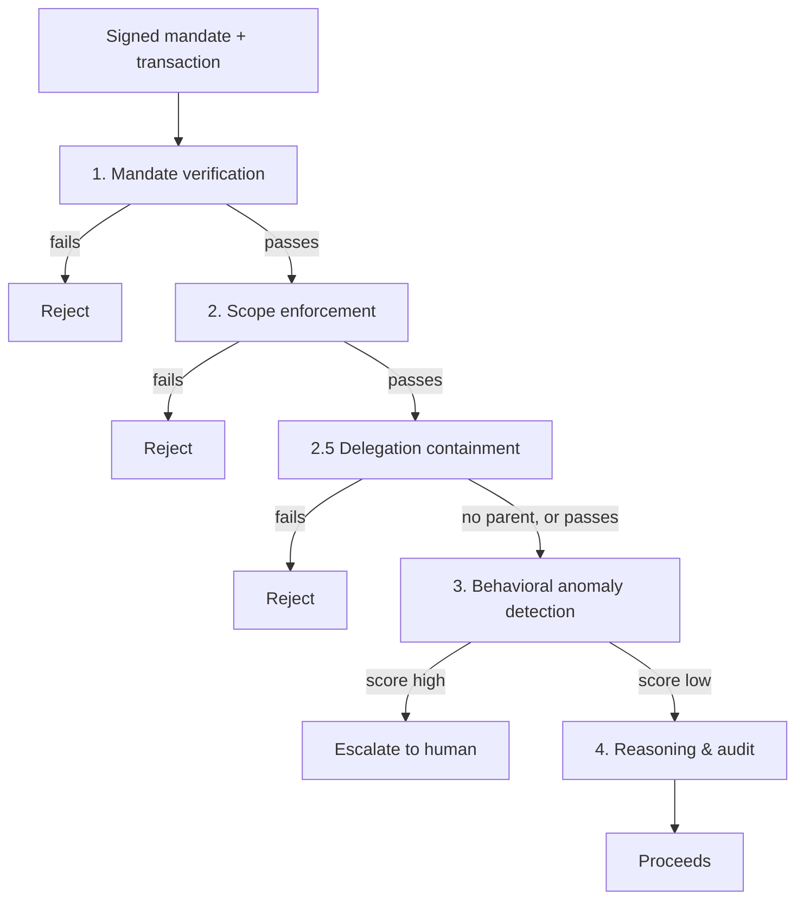

# Agentic-Commerce Transaction Sentinel

**Proves, mechanically and reproducibly, that an AI agent spending on a human's behalf stayed inside what that human actually authorized. Says so honestly even where it currently doesn't.**

AP2, ACP, and NPCI's UAP handle how an agent *carries* authorization (a signed intent, a cart, a credential). None of them check whether one specific transaction, or one specific delegation to another agent, actually *stayed inside* it. That's this project's whole job, sitting in front of those protocols, not replacing them.

Built for Razorpay's AI Buildathon 2026, Track 02. New here? [`OVERVIEW.md`](OVERVIEW.md) first, five minutes, plain language.

### Three minutes, if that's all you have

- **Watch a real agent get governed, live** (Operations view, headline scenario): a real Groq agent tries a budget-inflated delegation. The pipeline allows the transaction itself, then a separate real Layer 2.5 check catches the delegation and escalates it.
- **The proof panel** (Operations view): real Z3 proofs, a real significance test, a real reproducibility hash.
- **The headline number, with its receipt**: AUC-PR 0.9982, p ≈ 1.4×10⁻¹², and the exact command that reproduces it byte for byte ([Results](#results)).
- **The honest one**: this system caught 0% of an attack class it wasn't trained on. A layer built for the gap recovered 76% of it. What's still missed is named, not hidden.
- [`THREAT_MODEL.md`](THREAT_MODEL.md): what each layer stops, one page. [`EXCEPTIONS.md`](EXCEPTIONS.md): what it still can't confidently classify.

## The problem

Tell an agent "spend up to ₹2,000/month on groceries," and it spends ₹8,000 on electronics instead. Every classical fraud signal is clean: real card, real merchant, real device, nothing stolen. The failure is that the agent went outside what it was authorized to do, not that anyone stole anything. No existing fraud system asks that question. This checks a signed authorization, enforces the scope it actually grants, and watches for sessions that don't behave like the agent they claim to be.

Razorpay's own stack doesn't cover this either: Vulcan scores transactions, not the authorization behind them; Bumblebee reviews merchants, not agent sessions; Agent Studio's tools are post-hoc. Nothing there verifies a mandate or enforces a scope before the fact.

## Architecture

| Layer | Checks |
|---|---|
| 1. Mandate verification | Signature genuine, unexpired, right key, budget not exhausted |
| 2. Scope enforcement | Amount, merchant, category, time window match what was authorized |
| 2.5. Delegation containment | A delegated mandate can't exceed its parent's authority |
| 3. Behavioral anomaly detection | Catches sessions that pass 1-2 but don't move like the agent they claim |
| 4. Reasoning & audit | Explains the verdict in plain language, never sets it |

Layers 1, 2, and 2.5 are deterministic and can only ever *add* a block; Layer 3 can extend coverage but never override them. A bug in the learned layer can miss something new; it can never unblock something already flagged.



Also built, each with its own ADR in `docs/adr/`: Z3 formal verification of Layers 1/2/2.5 (`/formal`, 8/8 properties proved), cross-agent collusion/ring detection (`/collusion`), counterfactual "what would have changed this" explanations (`/counterfactual`), an escalation queue with a circuit breaker (`/escalation`), an AP2 interop adapter (`/interop`), policy-as-code (`/policy`), agent key revocation and rotation, signed run manifests (`/manifest`), and the real tool-calling Groq agent the whole pipeline governs live (`/agent`).

Anti-rigging is structural, not a convention: generated ground-truth labels are wrapped separately from session data, so a detector can only see a label by deliberately reaching past a type boundary it has no ordinary reason to touch. The held-out attack class below was built by someone with no visibility into detector internals. Six adversarial prompts were run against the real narration model, including a fake client that actively tries to comply, and the reported verdict never moved, because it's derived from the decision, never parsed from the model's text.

## Results

| | Precision | Recall | AUC-PR |
|---|---|---|---|
| Rules only | 1.00 | 0.83 | 0.85 |
| Full ensemble | 0.98 | 1.00 | **0.9982** |

McNemar p ≈ 1.4×10⁻¹² versus the rules-only baseline. Every number here reproduces from `python run_full_eval.py --n-legitimate 20000 --seed 42`; its signed receipt is [`docs/manifests/headline_full_evaluation.manifest.json`](docs/manifests/headline_full_evaluation.manifest.json), hash `c544e6a40ecf1e1aef91ce297ecdec47090951d10f0d55dfb2259fefee0943a6`, checked against your own working tree by `run_verify_manifest.py`.

**Held-out class** (mandate chaining: an agent bootstraps a bigger unauthorized action off a small legitimate one, withheld from training entirely, run once). Layers 1-3 alone: **0% recall**, all 3,529 attacks missed. With Layer 2.5 added: **76%**, 100% on 3 of 5 sub-variants, still only 2.6% on unauthorized hand-offs to a second agent, a real, disclosed, unclosed gap. Full breakdown: `docs/adr/0003`, `docs/adr/0004`.

Cost sweep, calibration, latency, and a real pacing fragility found in a 13-point sensitivity sweep: [`EXCEPTIONS.md`](EXCEPTIONS.md), not restated here.

## Why AP2, not NPCI's UAP

AP2 is real, public, and citable; UAP has no published schema yet, though this project's design already follows its reported direction where that's known. A field-by-field check against AP2's live repository found it has no field anywhere for how *wide* an authorization is, or whether a delegation stays inside its parent's. That's not a gap in the adapter; it's a different problem AP2 was never built to solve, and exactly what Layers 2 and 2.5 exist for. AP2-inspired, not an implementation of it. Full mapping: `docs/adr/0010`.

## Defense-only, and where this falls short

A detector and verifier, nowhere in this system offensive or autonomous. Attack generators exist solely to produce synthetic test traffic against this project's own detectors. Layer 3 can only ever add a block, never remove one, and every automated finding escalates to a human.

- All data is synthetic. Every anti-rigging measure exists to make these numbers as credible as synthetic data can be, not to hide that limit.
- Layer 3 is the biggest open question. Real agent timing may not match this generator's, and the sensitivity sweep shows exactly how much that would matter.
- Layers 1-3 alone can't see a delegation chain at all; Layer 2.5 closes most of that gap, not all of it.
- Narration isn't reproducible the way every number above is; an LLM's prose can't meet that bar even at temperature 0.
- The audit hash chain detects tampering. It doesn't prevent it.

One page per layer, what each stops and doesn't: [`THREAT_MODEL.md`](THREAT_MODEL.md). Every limitation above as a named, reproducible case: [`EXCEPTIONS.md`](EXCEPTIONS.md).

## Running it

```bash
python3.12 -m venv .venv && source .venv/bin/activate   # Windows: .venv\Scripts\Activate.ps1
pip install -r requirements-lock.txt && pip install -e ".[dev]"

pytest -q                                                       # 758 passed
python run_full_eval.py --n-legitimate 20000 --seed 42 --manifest-out my.json
python run_verify_policy_properties.py                          # Z3, expect 8/8 proved

uvicorn service.main:app --reload                                # the API service
cd frontend && npm install && npm run dev                        # the dashboard
```

Eight tests need `GROQ_API_KEY` (`.env.example` has the format); everything else, including the detection pipeline itself, works identically without one. One `run_*.py` entry point per evaluation or export at the repo root; `requirements-lock.txt` pins the full dependency closure so this reproduces the exact environment these numbers were verified against.

## License

MIT, see `LICENSE`.
