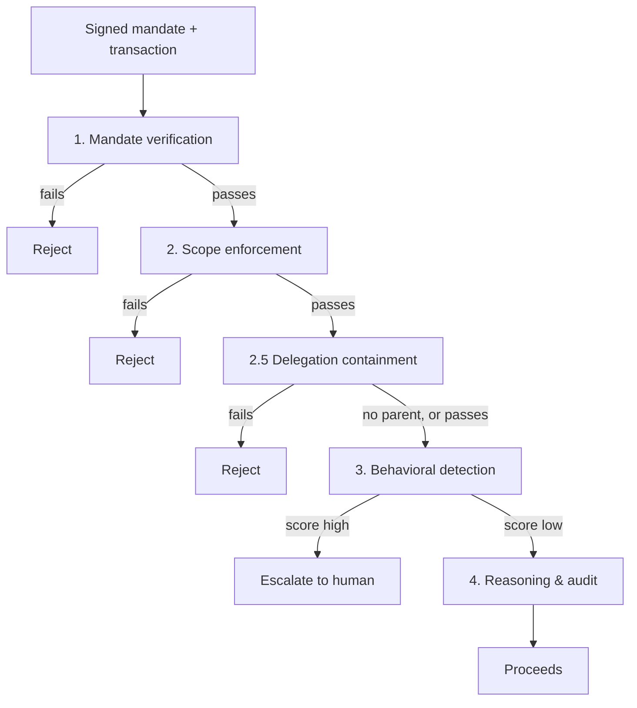

# Agentic-Commerce Transaction Sentinel


**[Live demo →](https://the-turing-line.vercel.app)**
Razorpay AI Buildathon 2026 · Track 02, AI Risk Manager
[Overview](OVERVIEW.md) · [Threat model](THREAT_MODEL.md) · [Exceptions](EXCEPTIONS.md)

**Proves, mechanically and reproducibly, that an AI agent spending on a human's behalf stayed inside what that human actually authorized.**

AP2, ACP, and NPCI's UAP handle how an agent *carries* authorization. None of them check whether one transaction, or one delegation to another agent, actually *stayed inside* it. That's this project's job, sitting in front of those protocols, not replacing them.

### Three minutes, if that's all you have

- **Watch a real agent get governed, live** (site's Operations view): a real Groq agent tries a budget-inflated delegation. The core pipeline allows the transaction, a separate real containment check catches the delegation and escalates it.
- **The proof panel**: real Z3 proofs, a real significance test, a real reproducibility hash, not screenshots: live exports from this repo's own test suite.
- **The headline number**: AUC-PR 0.9982, p ≈ 1.4×10⁻¹², one command reproduces it byte for byte.
- **The differentiator**: this system was tested against an attack class it never saw in training. It missed all of it. A new layer built for exactly that gap now catches 76% of it, the kind of result most teams would quietly bury, shown here on the front page because Track 2's own bar is "honest metrics," not flattering ones.

## The problem

Tell an agent "spend up to ₹2,000/month on groceries," and it spends ₹8,000 on electronics instead. Every classical fraud signal is clean: real card, real merchant, real device, nothing stolen. The agent just did something nobody authorized, and no fraud system asks that question, because until agents could spend on their own, "a human clicked buy" and "a human authorized this" were the same fact.

Razorpay's own fraud tooling doesn't cover it either: it scores transactions and reviews merchants after the fact, not whether an agent's action stayed inside what a human actually authorized before it happened. This sits in front of that, checking authorization *before* the transaction, not after.

## Architecture

| Layer | Checks | Package |
|---|---|---|
| 1. Mandate verification | Signature, expiry, key not revoked, budget not exhausted | `/mandate` |
| 2. Scope enforcement | Amount, merchant, category, time window vs. what was authorized | `/detect` |
| 2.5. Delegation containment | A delegated mandate can't exceed its parent's authority | `/containment` |
| 3. Behavioral detection | Catches sessions that pass 1–2 but don't behave like the agent they claim | `/detect`, `/features` |
| 4. Reasoning & audit | Explains the verdict in plain language, never sets it | `/reasoning` |



Layers 1, 2, and 2.5 are deterministic and can only ever add a block; Layer 3 extends coverage but can never override them.

Also built, each with its own ADR: Z3 formal verification (`/formal`, 8/8 properties proved), collusion/ring detection (`/collusion`), counterfactual explanations (`/counterfactual`), an escalation queue with a circuit breaker (`/escalation`), an AP2 adapter (`/interop`), policy-as-code (`/policy`), signed run manifests (`/manifest`), and the live tool-calling agent (`/agent`). Full index in the collapsible section below.

**Two pieces aren't wired into the live decision endpoint, on purpose**: Layer 2.5 containment and policy-as-code are both real, tested, and evaluated exactly the way the headline numbers use them. Reactively wiring a new call into the one live decision path this close to a deadline, without time to re-verify it doesn't regress anything Z3 already proved, was judged riskier than shipping the gap named plainly. `GET /mandates/{id}/chain` reaches containment today as a separate read. Full reasoning: [THREAT_MODEL.md](THREAT_MODEL.md).

## Results

| | Precision | Recall | AUC-PR |
|---|---|---|---|
| Rules only | 1.00 | 0.83 | 0.85 |
| Full ensemble | 0.98 | 1.00 | **0.9982** |

McNemar p ≈ 1.4×10⁻¹² vs. the rules-only baseline. Reproduces from `python run_full_eval.py --n-legitimate 20000 --seed 42`; signed receipt at [`docs/manifests/headline_full_evaluation.manifest.json`](docs/manifests/headline_full_evaluation.manifest.json), hash `c544e6a4…0943a6`.

**Held out class** (mandate chaining: an agent bootstraps a bigger unauthorized action off a small legitimate one, withheld from training, tested once): 0% recall before the fix, **76% after** a new containment layer built specifically for it. What's still open is named, not smoothed over: `docs/adr/0003`, `docs/adr/0004`.

## Defense-only

A detector and verifier, nowhere offensive or autonomous. Attack generators exist solely to produce synthetic test traffic against this project's own detectors. Layer 3 can only ever add a block, never remove one, and every automated finding escalates to a human.

## Running it

```bash
python3.12 -m venv .venv && source .venv/bin/activate   # Windows: .venv\Scripts\Activate.ps1
pip install -r requirements-lock.txt && pip install -e ".[dev]"

pytest -q                                                       # 772 passed
python run_full_eval.py --n-legitimate 20000 --seed 42
python run_verify_policy_properties.py                          # Z3, expect 8/8 proved

uvicorn service.main:app --reload                                # the API service
cd frontend && npm install && npm run dev                        # the dashboard
```

Eight tests need `GROQ_API_KEY`; everything else, including the detection pipeline itself, works identically without one. Or skip all of this and use the live site.

## Repository layout

| Path | Contents |
|---|---|
| `/mandate` `/detect` `/containment` `/features` | The five layers above |
| `/reasoning` | Narration and the hash-chained audit log |
| `/formal` | Z3 proofs of the deterministic layers |
| `/service` | The FastAPI service, plus the Dockerfile |
| `/generator` `/eval` | Synthetic traffic, every attack class, the evaluation harness |
| `/agent` | The real tool-calling agent Sentinel governs live |
| `/frontend` | The dashboard, hosted at the live demo link |
| `/docs/adr` | One design record per major decision |
| `/tests` | 772 tests |

**Cut deliberately:** an MCP connector, an adversarial robustness study, drift detection, a second held-out class, hosting the API service continuously.

---

<details>
<summary><b>Full design-decision index (16 ADRs)</b></summary>

| ADR | Decision |
|---|---|
| [0001](docs/adr/0001-attack-variant-hardness.md) | Deliberately widened attack-pacing bounds so Layer 3's win isn't one reconstructed threshold rule |
| [0002](docs/adr/0002-comparing-a-scorer-against-a-rules-engine.md) | Why precision-at-fixed-recall is unsatisfiable against a saturated baseline, and what test is used instead |
| [0003](docs/adr/0003-held-out-class-evaluation.md) | The held-out class: 0% recall, evaluated exactly once |
| [0004](docs/adr/0004-delegation-chain-containment.md) | Layer 2.5's design and its 76% recovery of the held-out gap |
| [0005](docs/adr/0005-formal-verification-of-deterministic-layers.md) | Z3 encoding, 8/8 properties proved, a reversed comparison caught with a real counterexample |
| [0006](docs/adr/0006-collusion-ring-detection.md) | Graph/Louvain ring detection, 100% recall and precision, a disclosed density boundary |
| [0007](docs/adr/0007-tamper-evident-audit-log.md) | SHA-256 hash chain over the audit log |
| [0008](docs/adr/0008-counterfactual-explanations.md) | Solver-verified counterfactuals; the behavioral one was built then pulled from the live path as a disclosed risk |
| [0009](docs/adr/0009-escalation-queue-and-circuit-breaker.md) | Human-gated escalation queue and a sticky circuit breaker |
| [0010](docs/adr/0010-ap2-interop-adapter.md) | A live-repo field check that corrected this project's own earlier AP2 claim |
| [0011](docs/adr/0011-delegation-graph-and-narration-chat.md) | A live delegation-chain view and a "try to talk it out of its verdict" affordance |
| [0012](docs/adr/0012-property-based-verification-of-containment.md) | Hypothesis testing of the stateful ledger Z3's proof can't reach |
| [0013](docs/adr/0013-policy-as-code.md) | Declarative YAML policy, proved identical to Layer 2, not live-wired |
| [0014](docs/adr/0014-agent-key-lifecycle.md) | Key revocation/rotation; three real bugs found while wiring it in |
| [0015](docs/adr/0015-run-manifests.md) | Signed manifests; reproducibility checked twice, confirmed byte-exact |
| [0016](docs/adr/0016-governed-live-agent.md) | The real tool-calling agent, isolated to three tools, governed live |

</details>

<details>
<summary><b>Full evaluation detail: significance, calibration, cost sweep, sensitivity grid</b></summary>

**Statistical significance.** The rules baseline is precision-saturated at 1.0 by construction, so "beat it on precision" is unsatisfiable by any detector; [ADR 0002](docs/adr/0002-comparing-a-scorer-against-a-rules-engine.md) covers why. The real test: McNemar (paired, at the operating threshold): baseline-only-correct 9, ensemble-only-correct 69, **p = 1.381×10⁻¹²**. DeLong AUC-ROC comparison: +0.0850 (SE 0.00926), reported as a secondary check.

**Calibration.** Brier score 0.00499, ECE 0.00532. The reliability diagram's near-zero bin holds 3,752 rows; every bin between 0.1–0.9 holds fewer than ten.

**Cost sweep** (cost ratio 10.0, 4,168 sessions, 411 attacks):

| Threshold | Precision | Recall | Blocked legit/10k | Missed attacks/10k |
|---|---|---|---|---|
| 0.006 | 0.9580 | 1.0000 | 43.2 | 0.0 |
| 0.100 | 0.9784 | 0.9903 | 21.6 | 9.6 |
| 0.400 | 0.9825 | 0.9562 | 16.8 | 43.2 |
| 1.000 | 1.0000 | 0.8297 | 0.0 | 167.9 |

**Sensitivity grid** (13 points, one factor at a time): 12 of 13 still beat the rules baseline significantly. The one that doesn't, `scripted_pacing_max35`, widens scripted-client pacing until it overlaps legitimate jitter; rules-invisible recall drops from 0.9859 to 0.5070. Disclosed, not hidden: [EXCEPTIONS.md](EXCEPTIONS.md).

**Held-out, full breakdown:**

| Variant | n | Rules-only | + Containment |
|---|---|---|---|
| `budget_escalation` | 456 | 0% | 100% |
| `breadth_escalation` | 439 | 0% | 100% |
| `temporal_outlive` | 462 | 0% | 100% |
| `fanout_structuring` | 1,748 | 0% | 75.46% |
| `unauthorized_subdelegation` | 424 | 0% | 2.59% |

**Latency:** p50 2.76ms, p95 3.42ms, p99 4.05ms, 2,950 real decisions.

**Reproducibility:** the same run was executed twice and every metric matched byte-for-byte except wall-clock latency, which by definition measures that run's own hardware. [ADR 0015](docs/adr/0015-run-manifests.md).

</details>

<details>
<summary><b>API reference (15 endpoints)</b></summary>

`service/main.py`, FastAPI, docs at `/docs` when running locally.

| Method | Path | Purpose |
|---|---|---|
| `GET` | `/health` | Liveness check |
| `GET` | `/agents/demo` | Seeded demo agents (non-secret keys) |
| `POST` | `/agents/register` | Register an Ed25519 public key |
| `POST` | `/agents/{id}/keys/{key_id}/revoke` | Revoke a key, always a human action |
| `POST` | `/agents/{id}/keys/{old_key_id}/rotate` | Rotate a key with a documented overlap window |
| `GET` | `/agents/{id}/keys/{key_id}/revocation` | Look up a revocation |
| `POST` | `/sessions/decide` | Run one session through Layers 1–4 |
| `GET` | `/audit/{session_id}` | Every audit record for a session |
| `GET`/`POST` | `/escalations...` | List, review, resolve an escalation |
| `GET`/`POST` | `/agents/{id}/circuit-breaker...` | Check or reset a suspension |
| `GET` | `/mandates/{id}/chain` | A mandate's full delegation chain and containment verdicts |

No endpoint mutates a mandate or a payment outside `/sessions/decide`. Every mutating endpoint requires a named human actor.

</details>

<details>
<summary><b>Named exceptions: every case this system won't confidently classify</b></summary>

Full detail and reproduction commands: [EXCEPTIONS.md](EXCEPTIONS.md).

1. **Mandate-chaining residual.** `unauthorized_subdelegation` and the first sibling of `fanout_structuring`. See held-out result above.
2. **One in-distribution miss.** 99.76% recall, not literally 100%; one session landed at 27% of the threshold.
3. **Scripted-pacing fragility.** See the sensitivity grid above.
4. **A sparse calibration middle.** Few sessions score between 0.1 and 0.9.
5. **A measured, unexplained false-positive rate.** 21.6/10k legitimate sessions blocked; plausible cause named, not confirmed.
6. **Docker untested end to end.** Package list verified against the real import graph; no Docker binary available to run an actual build.

</details>

## License

MIT, see [`LICENSE`](LICENSE).
