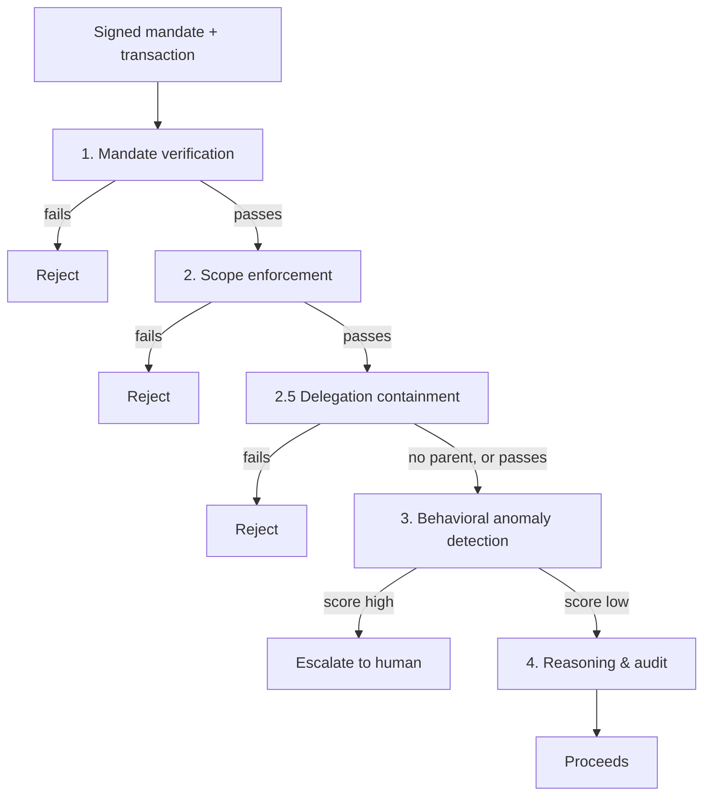

# Agentic-Commerce Transaction Sentinel

**[Live demo →](https://the-turing-line.vercel.app)** · [OVERVIEW.md](OVERVIEW.md) (five minutes, plain language) · Razorpay AI Buildathon 2026, Track 02

**Proves, mechanically and reproducibly, that an AI agent spending on a human's behalf stayed inside what that human actually authorized. Says so plainly even in the one case where it currently doesn't, because that's the standard the rest of this document holds itself to.**

AP2, ACP, and NPCI's UAP handle how an agent *carries* authorization (a signed intent, a cart, a credential). None of them check whether one specific transaction, or one specific delegation to another agent, actually *stayed inside* it. That's this project's whole job, sitting in front of those protocols, not replacing them.

The live site has real evaluation data, a sandbox to build a mandate and try to break it, and the governed live agent in action.

### Three minutes, if that's all you have

- **Watch a real agent get governed, live** (the site's Operations view, headline scenario): a real Groq agent tries a budget-inflated delegation. The pipeline allows the transaction itself, then a separate real Layer 2.5 check catches the delegation and escalates it.
- **The proof panel** (Operations view): real Z3 proofs, a real significance test, a real reproducibility hash.
- **The headline number, with its receipt**: AUC-PR 0.9982, p ≈ 1.4×10⁻¹², and the exact command that reproduces it byte for byte ([Results](#results)).
- **A real gap, found and mostly closed**: a held-out attack class exposed a blind spot in the original three-layer design. A new layer built specifically for it recovers most of that gap, and what's still open is named directly, not buried.
- [`THREAT_MODEL.md`](THREAT_MODEL.md): what each layer stops, one page. [`EXCEPTIONS.md`](EXCEPTIONS.md): the specific, reproducible cases still open.

## The problem

Tell an agent "spend up to ₹2,000/month on groceries," and it spends ₹8,000 on electronics instead. Every classical fraud signal is clean: real card, real merchant, real device, nothing stolen. The failure is that the agent went outside what it was authorized to do, not that anyone stole anything. No existing fraud system asks that question. This checks a signed authorization, enforces the scope it actually grants, and watches for sessions that don't behave like the agent they claim to be.

Razorpay's own stack doesn't cover this either: Vulcan scores transactions, not the authorization behind them; Bumblebee reviews merchants, not agent sessions; Agent Studio's tools are post-hoc. This sits in the gap in front of all of them: before authorization, not after.

## Architecture

| Layer | Checks |
|---|---|
| 1. Mandate verification | Signature genuine, unexpired, right key, budget not exhausted |
| 2. Scope enforcement | Amount, merchant, category, time window match what was authorized |
| 2.5. Delegation containment | A delegated mandate can't exceed its parent's authority |
| 3. Behavioral anomaly detection | Catches sessions that pass 1-2 but don't move like the agent they claim |
| 4. Reasoning & audit | Explains the verdict in plain language, never sets it |

Layers 1, 2, and 2.5 are deterministic and can only ever *add* a block; Layer 3 extends coverage but can never override them. That ordering is deliberate: the learned layer can miss something new, but it can never unblock something a deterministic rule already flagged.



**The diagram above is the conceptual decision order, not today's live call graph.** `service.main.decide()`, the API's one per-session decision endpoint, runs Layers 1, 2, and 3 automatically; Layer 2.5 is a real check against the same production `containment` engine, exercised the same way in the evaluation that produces the 76.14% headline number above, but reached today through a separate, explicit call (`GET /mandates/{id}/chain`, or the `/delegation` view), not folded into `decide()`'s own automatic path. A transaction whose own scope is fine can be allowed by `decide()` even while its delegation chain would fail containment, exactly the gap the Operations demo's headline scenario is built to show plainly rather than hide. Named directly, not left implicit: [`THREAT_MODEL.md`](THREAT_MODEL.md#layer-25-delegation-chain-containment-containment) has the full reasoning for leaving it this way this close to submission rather than wiring it in under time pressure.

Also built, each with its own ADR in `docs/adr/`: Z3 formal verification of Layers 1/2/2.5 (`/formal`, 8/8 safety properties proved exhaustively), cross-agent collusion/ring detection (`/collusion`), counterfactual "what would have changed this verdict" explanations (`/counterfactual`), an escalation queue with a circuit breaker (`/escalation`), an AP2 interop adapter (`/interop`), policy-as-code (`/policy`), agent key revocation and rotation, signed run manifests (`/manifest`), and the real tool-calling Groq agent the whole pipeline governs live (`/agent`).

Anti-rigging is structural, not a convention: generated ground-truth labels are wrapped separately from session data, so a detector can only see a label by deliberately reaching past a type boundary it has no ordinary reason to touch. The held-out attack class below was built by someone with no visibility into detector internals. Six adversarial prompts were run against the real narration model, including a fake client that actively tries to comply, and the reported verdict never moved, because it's derived from the decision, never parsed from the model's text.

## Results

| | Precision | Recall | AUC-PR |
|---|---|---|---|
| Rules only | 1.00 | 0.83 | 0.85 |
| Full ensemble | 0.98 | 1.00 | **0.9982** |

McNemar p ≈ 1.4×10⁻¹² versus the rules-only baseline. Every number here reproduces from `python run_full_eval.py --n-legitimate 20000 --seed 42`; its signed receipt is [`docs/manifests/headline_full_evaluation.manifest.json`](docs/manifests/headline_full_evaluation.manifest.json), hash `c544e6a40ecf1e1aef91ce297ecdec47090951d10f0d55dfb2259fefee0943a6`, checked against your own working tree by `run_verify_manifest.py`.

**Held-out class** (mandate chaining: an agent bootstraps a bigger unauthorized action off a small legitimate one, withheld from training entirely, tested once). The original three-layer design missed it completely; Layer 2.5, built specifically for this gap, recovers **76%** of it, 100% on 3 of 5 sub-variants. What's still open, 2.6% on unauthorized hand-offs to a second agent, is named directly rather than smoothed over. Full breakdown: `docs/adr/0003`, `docs/adr/0004`.

Cost sweep, calibration, latency, and a real pacing sensitivity found in a 13-point robustness sweep: [`EXCEPTIONS.md`](EXCEPTIONS.md), not restated here.

## Why AP2, not NPCI's UAP

AP2 is real, public, and citable; UAP has no published schema yet, though this project's design already follows its reported direction where that's known. A field-by-field check against AP2's live repository found it has no field anywhere for how *wide* an authorization is, or whether a delegation stays inside its parent's. That's a different problem AP2 was never built to solve, and exactly what Layers 2 and 2.5 exist for. AP2-inspired, not an implementation of it. Full mapping: `docs/adr/0010`.

## Defense-only, and current scope

A detector and verifier, not an offensive or autonomous system anywhere in the stack. Attack generators exist solely to produce synthetic test traffic against this project's own detectors. Layer 3 can only ever add a block, never remove one, and every automated finding escalates to a human rather than acting alone.

What's explicitly in scope for this build, stated plainly rather than glossed over:

- All data is synthetic, from a fully seeded, reproducible generator. Every anti-rigging measure in this project exists to make these numbers hold up under scrutiny.
- Layer 3's real-world transfer is the clearest next step: a 13-point sensitivity sweep already quantifies how much real agent timing could move these numbers, rather than leaving it a guess.
- Layer 2.5 closes most of the delegation-chain gap the held-out evaluation found; agent-identity continuity across a chain is the next piece of it.
- Narration explains a decision; it isn't a reproducible artifact itself, the same way no LLM's prose is, even at temperature 0.
- The audit hash chain detects tampering. That's the specific guarantee it's designed to provide.

One page per layer, what each stops and doesn't: [`THREAT_MODEL.md`](THREAT_MODEL.md). Every item above as a named, reproducible case: [`EXCEPTIONS.md`](EXCEPTIONS.md).

## Running it

```bash
python3.12 -m venv .venv && source .venv/bin/activate   # Windows: .venv\Scripts\Activate.ps1
pip install -r requirements-lock.txt && pip install -e ".[dev]"

pytest -q                                                       # 772 passed
python run_full_eval.py --n-legitimate 20000 --seed 42 --manifest-out my.json
python run_verify_policy_properties.py                          # Z3, expect 8/8 proved

uvicorn service.main:app --reload                                # the API service
cd frontend && npm install && npm run dev                        # the dashboard
```

Eight tests need `GROQ_API_KEY` (`.env.example` has the format); everything else, including the detection pipeline itself, works identically without one. One `run_*.py` entry point per evaluation or export at the repo root; `requirements-lock.txt` pins the full dependency closure so this reproduces the exact environment these numbers were verified against. Or skip all of the above and use the live site: [the-turing-line.vercel.app](https://the-turing-line.vercel.app).

## License

MIT, see `LICENSE`.
