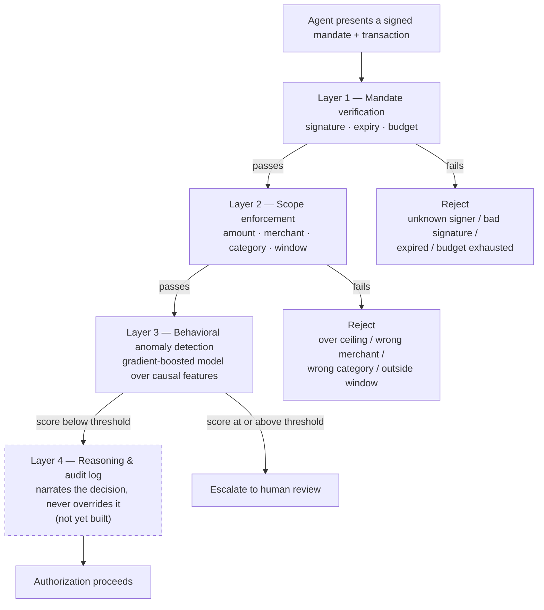
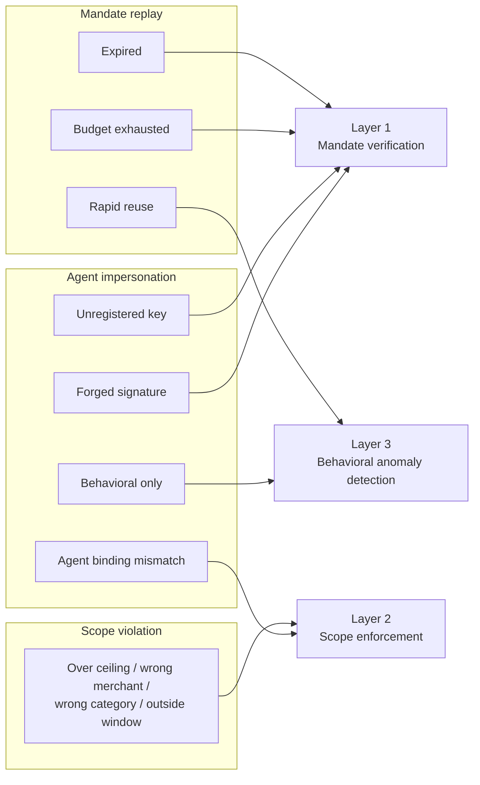

# Agentic-Commerce Transaction Sentinel

**A defense-only verification layer that checks whether an AI agent's payment stays inside what its human actually authorized — before the payment goes through.**

Built for Razorpay's AI Buildathon 2026, Track 02 (AI Risk Manager).

---

## Table of contents

1. [What problem this solves](#1-what-problem-this-solves)
2. [Why this doesn't duplicate Razorpay's existing stack](#2-why-this-doesnt-duplicate-razorpays-existing-stack)
3. [Architecture](#3-architecture)
4. [What's built, and how it works](#4-whats-built-and-how-it-works)
5. [Synthetic data: how it's generated and why it can be trusted](#5-synthetic-data-how-its-generated-and-why-it-can-be-trusted)
6. [Attack taxonomy](#6-attack-taxonomy)
7. [Evaluation results](#7-evaluation-results)
8. [Why AP2, not NPCI's UAP](#8-why-ap2-not-npcis-uap)
9. [What's not built yet, and why](#9-whats-not-built-yet-and-why)
10. [Defense-only, by design](#10-defense-only-by-design)
11. [Known limitations, stated plainly](#11-known-limitations-stated-plainly)
12. [Repository structure](#12-repository-structure)
13. [Running this yourself](#13-running-this-yourself)

---

## 1. What problem this solves

Fraud detection today asks one question: *is this transaction fraudulent?* It checks the card, the device, the location, the merchant — all on the assumption that a human is the one clicking "pay."

That assumption no longer holds everywhere. Razorpay and NPCI have launched agentic UPI payments built on Claude, with Zomato, Swiggy, and Zepto as initial partners — an AI agent can complete a UPI purchase on a user's behalf without the user confirming each individual transaction. NPCI is separately developing a Unified Agent Protocol (UAP) to register and authorize AI agents across the UPI network more broadly.

Once an agent can spend money on someone's behalf, a second question appears that no existing fraud system asks:

> **Not "is this transaction fraudulent," but "is this agent staying inside what the human actually agreed to."**

A concrete example: a user tells their grocery-shopping agent, "spend up to ₹2,000/month on groceries." Every resulting transaction can be completely legitimate by every classical signal — real card, real merchant, real device, no stolen credentials anywhere — and still be exactly the failure this project exists to catch, if the agent quietly spends ₹8,000 on electronics instead. The card isn't stolen. The agent is simply acting outside the authority it was given.

This project is a verification layer for that specific failure mode: it checks an agent's cryptographically signed authorization, enforces the spending scope that authorization actually grants, and watches for sessions that don't look like the agent that was supposed to be acting — even when nothing about the authorization itself is wrong.

## 2. Why this doesn't duplicate Razorpay's existing stack

Razorpay already runs a serious risk stack. This project is deliberately scoped to sit next to it, not inside it:

| Existing system | What it does | What it doesn't do |
|---|---|---|
| **Vulcan** | Payments foundation model — per-transaction fraud scoring, routing, return-to-origin decisions | Doesn't know what a human authorized an *agent* to do; scores the transaction, not the authorization behind it |
| **Bumblebee** | Multi-agent risk review of merchants at onboarding | Operates on merchants, not on individual agent-initiated transactions |
| **Agent Studio** (Dispute Responder, Subscription Recovery, Abandoned Cart, Cashflow Forecaster, RTO Shield) | Post-hoc and operational tooling for merchants | None of these verify a cryptographic mandate or enforce a spending scope before authorization |

Nothing in that stack today verifies a signed authorization from a human, checks whether an agent's transaction fits inside it, or watches for behavioral drift in how an agent uses that authorization over time. That's the gap this project fills — sitting in front of authorization, not reviewing after the fact.

## 3. Architecture

Three detection layers feed a reasoning/audit layer:

| Layer | Purpose | Status |
|---|---|---|
| **1. Mandate verification** | Is the agent's signed authorization genuine, unexpired, bound to this agent's registered key, and not already used up? | **Built** |
| **2. Scope enforcement** | Does this specific transaction — amount, merchant, item category, timing — fit inside what the mandate actually authorizes? | **Built** |
| **3. Behavioral anomaly detection** | Does this agent's session look like the agent it claims to be, based on patterns the first two layers structurally cannot see? | **Built** |
| **4. Reasoning & audit** | Given the deterministic and learned layers' outputs, narrate the decision in plain language. Never sets the verdict — only explains what the earlier layers already decided. | **Not yet built** |

Every decision the finished system makes writes an append-only audit record, and every block is designed to be human-reviewable. This is a **detector and verifier**, not an autonomous enforcement system — see [§10](#10-defense-only-by-design) for why that's a hard constraint here, not a nicety.

### Why the split between deterministic and learned layers

Layers 1 and 2 are deterministic on purpose. A spending ceiling, a merchant allowlist, a time window — these are facts that can be checked exactly, with no tolerance and no learned uncertainty, and a reviewer should be able to reproduce the verdict by hand from the mandate and the transaction alone.

Layer 3 exists because some attacks are *not* expressible as a rule. An agent that presents a completely genuine, in-scope, unexpired mandate — but is being driven by something other than the agent it claims to be — passes Layers 1 and 2 by construction. That isn't a gap in the rules; it's the boundary of what rules can see at all. Layer 3 is combined with Layers 1 and 2 through a strict ensemble rule: the deterministic layers can only ever be *added to*, never overridden. A session Layer 1 or 2 already blocks stays blocked regardless of what Layer 3's score says; Layer 3 can only extend coverage into the sessions the deterministic layers already let through. This means a bug or drift in the learned layer can, at worst, fail to catch something new — it can never unblock something the deterministic layers correctly flagged.

### Data flow



## 4. What's built, and how it works

### Mandate schema and signing (`/mandate`)

A cryptographically signed mandate format (`Mandate`, `MandateScope`, `SignedMandate`) encodes exactly what a human authorized:

- a spending ceiling (`max_amount`)
- allowed merchant categories, and optionally a specific merchant allowlist
- allowed item categories
- a valid time window (`valid_from` / `valid_until`)
- a maximum number of times the mandate can be redeemed (`max_transaction_count`)

Every mandate is signed with **Ed25519** over a deterministic, byte-exact encoding of its contents. The encoding is custom (`mandate/signing.py::canonical_bytes`), not a library's default JSON dump — field order, decimal formatting, and datetime formatting are not contractually stable across library versions, and a signature scheme that silently breaks when a dependency updates is not a signature scheme. Because the signature covers the full canonical encoding, a mandate cannot be altered after signing — inflating the spending ceiling, widening the category, extending the window — without invalidating the signature. This is verified directly by tests that tamper with a signed mandate's content and confirm the signature check fails.

### Mandate verification (Layer 1)

Verification checks four independent things about a presented mandate:

1. Is the signature genuine, from a key registered for the claiming agent?
2. Is the current time inside the mandate's valid window?
3. Has the mandate expired outright (independent of the transaction window)?
4. Has the mandate already been redeemed up to its usage budget?

All four are checked and *all* failing reasons are reported — verification doesn't stop at the first failure. An audit trail can therefore say "rejected for being both expired and over-budget" rather than hiding the second reason behind the first. Budget tracking is stateful (`MandateLedger`), incremented only when a transaction is actually allowed to proceed — a transaction that gets blocked never consumes the mandate's budget, otherwise an attacker could exhaust a legitimate user's mandate purely by sending sessions the system rejects.

### Scope enforcement (Layer 2)

A deterministic policy engine (`detect/scope.py`) checks a session against ten named rules, split into two groups:

- **Binding checks** — does the mandate presented in this session actually belong to this agent and this human (mandate ID, agent ID, and user ID must all match).
- **Transaction scope checks** — amount within ceiling, currency match, merchant category allowed, item category allowed, merchant identity allowed (if the mandate restricts to specific merchants), and the transaction falls inside the mandate's time window.

Like Layer 1, every rule that fires is collected, not just the first. And every comparison is **exact** — a `Decimal` amount is compared with `>`, not with a tolerance band, and timestamps are compared directly. A tolerance here would define a range just past the authorized limit where spending is silently permitted, which is a vulnerability, not a convenience — so there isn't one.

### Rules-only baseline

`detect/baseline.py` combines Layers 1 and 2 into a single stateful classifier (`RulesOnlyBaseline`) that processes a chronologically ordered stream of sessions and returns a block/allow verdict for each, along with every rule that fired. This baseline is not a placeholder for the eventual system — it's the number the behavioral model has to beat with statistical significance, or get dropped from the design entirely. See [§7](#7-evaluation-results).

### Feature extraction (`/features`)

`features/session.py` extracts a causal feature vector from each session — event timing and regularity, session composition (which lifecycle stages are present), and features relative to the agent's and mandate's own prior history (time since last use, prior session count, amount relative to the agent's running mean). Two design choices matter here:

- **Causality.** Every history-relative feature only sees sessions that occurred *before* the one being featurized. A corpus-wide aggregate (e.g. an agent's mean amount computed over the whole dataset) would leak information from future sessions backward into earlier ones — a leak that looks like excellent offline performance and produces nothing useful in production.
- **Structural label isolation.** The extractor's function signatures only accept a `SessionTrace`, never a `LabeledSession` (the wrapper that carries ground truth). This means a feature can only become a function of the label if a developer deliberately reaches into a wrapper object the extractor has no ordinary reason to touch — and there's a test that parses the module's own source as an AST and asserts it contains no reference to the label fields at all, so the guarantee doesn't rest on remembering to keep it.

### Behavioral anomaly detection (Layer 3, `/detect`)

Four modules, each with a narrow job:

- **`behavioral.py`** — a gradient-boosted classifier trained *only* on the residual set: sessions the rules-only baseline already let through. This is the property that keeps the model's reported performance honest — it never gets credit for re-catching an attack Layers 1 and 2 already catch, because it never sees those sessions during training. Training uses a chronological split (train / validation / test, in time order, never shuffled), with hard gates on minimum row counts and minimum positive-class size so the model fails loudly on too little data rather than fitting anyway.
- **`calibration.py`** — turns the model's raw score into a block/allow decision. The threshold is chosen to minimize expected cost under an explicit, named, documented false-negative-to-false-positive cost ratio (`DEFAULT_FALSE_NEGATIVE_TO_FALSE_POSITIVE_COST_RATIO`), rather than picked by eyeballing a precision/recall tradeoff. That ratio is a stated assumption, not measured data — no real fraud-loss or support-cost figures exist for a synthetic-data submission — so the module also produces a sensitivity sweep across a range of plausible ratios, reporting how much the chosen threshold would move if the assumption were wrong.
- **`ensemble.py`** — combines the Layer 1/2 verdict with the Layer 3 score under the one-directional rule described in [§3](#3-architecture): rules can add a block, never remove one.
- **`attribution.py`** — SHAP feature attribution, both a global ranking (which features matter most on average) and a per-session breakdown (which features drove one specific score). The per-session breakdown is what the reasoning layer will eventually narrate from.

### Evaluation and significance testing (`/eval`)

`eval/significance.py` implements a paired McNemar test — the correct comparison when two classifiers (rules-only baseline vs. ensemble) are scored on the *same* sessions, since their errors are paired rather than independent. That is the primary significance test, because both systems are being compared as hard classifiers at a chosen operating point.

`eval/delong.py` adds the corresponding test for two *correlated AUCs*, hand-rolled because no dependency here provides one: the closed-form variance estimator from DeLong, DeLong and Clarke-Pearson (1988), built from each score's placement values. It is verified in `tests/test_delong.py` against a four-row case whose structural components are computed by hand, against scikit-learn's AUC, and against a bootstrap estimate of the same standard error — not merely exercised for absence of exceptions.

`eval/metrics.py` computes AUC-PR (the primary metric, since the class imbalance makes ROC insensitive to exactly the false positives that matter), AUC-ROC, the Brier score and a calibration curve, all directly in numpy for speed inside the bootstrap loop and all asserted to match scikit-learn exactly, including on tied scores. `eval/bootstrap.py` supplies stratified percentile confidence intervals, `eval/cost_sweep.py` extends the cost model in `detect/calibration.py` across the entire threshold range, `eval/latency.py` measures end-to-end per-decision latency, and `eval/sensitivity.py` regenerates and re-evaluates everything across a grid of generator parameters.

`eval/milestone_a.py` reports the rules-vs-ensemble comparison; `eval/milestone_b.py` runs the complete metric set and the gate verdict. Results are in [§7](#7-evaluation-results).

One structural wrinkle in comparing these two systems is documented rather than smoothed over: the rules-only baseline emits a block/allow verdict, not a ranking, and its precision is 1.0 by construction. What that means for AUC and for the gate is set out in `docs/adr/0002-comparing-a-scorer-against-a-rules-engine.md`.

## 5. Synthetic data: how it's generated and why it can be trusted

All data used in this project is synthetic, generated by a fully parameterized, seeded generator committed in `/generator`. Two properties make that a defensible foundation rather than just a convenient one:

**Full reproducibility.** Every random decision — including which cryptographic keys get generated and which session IDs get assigned — routes through a single seeded `numpy.random.Generator`. The same `(n, seed)` pair always produces byte-identical output, verified directly by tests. A reviewer doesn't have to take any reported number on faith; they can regenerate the exact dataset that produced it from a clean clone.

**Amounts grounded in reality, not invented.** Category weights and order values are loosely anchored to public 2025–2026 Indian e-commerce market data (Mordor Intelligence, IMARC, the Bain & Company/Flipkart "How India Shops Online 2025" report) rather than arbitrary numbers picked to make the data look convenient.

**Legitimate traffic** simulates a population of AI agents, each with its own signing key and category preferences, transacting on behalf of a population of human users. Each session includes a full lifecycle trace (intent captured → mandate presented → catalog browsed → cart built → payment attempted → payment result) with realistic timing jitter between stages, and mandates are sometimes issued fresh and sometimes reused across multiple sessions (simulating a standing grocery-style authorization), which is also what makes mandate-replay attacks against a genuinely spent mandate meaningful rather than contrived.

**Attack traffic** is built by taking the legitimate corpus as a read-only input and constructing sessions that violate it along specific, controlled dimensions — see [§6](#6-attack-taxonomy). Attack generators never mutate the legitimate corpus they're built against, and every attack generator draws from its own seeded random stream so that three generators run together don't make correlated choices that would show up as spurious structure a model could latch onto rather than learning something real.

**Anti-rigging enforced structurally.** Every generated session carries its ground-truth label (`LabeledSession`) wrapped separately from the raw session data (`SessionTrace`), so passing the raw trace into a detector or feature extractor is the only thing that type-checks without deliberate effort. This is the same mechanism described in [§4](#4-whats-built-and-how-it-works) for feature extraction, applied at the generator level too.

**Attack-variant hardness is a deliberate, documented choice, not a default.** The scripted-client pacing and browse-skip probability that define the `behavioral_only` impersonation variant were widened specifically so that no single feature threshold could separate it from legitimate traffic — see `docs/adr/0001-attack-variant-hardness.md` for the reasoning and the diagnostic that validated it.

## 6. Attack taxonomy

Three classes of attack are generated and used for evaluation. A fourth class is deliberately withheld from every stage of development.

### 1. Mandate replay

An agent presents an authorization it shouldn't be able to use again, in one of three ways:

- **Expired** — the mandate lapsed hours to days ago. Caught by Layer 1's time-window check.
- **Budget exhausted** — the mandate's transaction count is already fully consumed by legitimate use. Caught by Layer 1's ledger check, but only if the ledger has actually processed the legitimate sessions that spent it — this variant specifically tests that statefulness.
- **Rapid reuse** — the mandate is genuine, unexpired, in-scope, and still has budget remaining. Layers 1 and 2 both pass it. The only thing wrong is the *cadence*: a reuse seconds-to-minutes behind the previous legitimate use, in a gap the legitimate generator's own minimum reuse interval never produces. This is one of the two variants Layer 3 exists to catch.

### 2. Scope violation

The mandate is genuine, correctly signed, unexpired, and unspent — the agent simply spends it on something the human didn't authorize: too much money, the wrong merchant, the wrong item category, or outside the agreed time window. Layer 2 is *by construction* the oracle for this class — if the scope engine checks all six scope dimensions correctly, any violation of one of them is caught with certainty. So near-perfect recall on this class isn't a claim about the attacks being weak; it's a claim about Layer 2 being correct, and the honest way to make the class hard is to generate violations at the **boundary** rather than the extreme — amounts 0.05%–4% past the ceiling, timestamps 2–240 minutes past the window — so a sloppy or rounding-tolerant implementation of Layer 2 would fail visibly instead of scoring well on comfortable 10x overshoots.

### 3. Agent impersonation

A client that is not the registered agent drives a session as though it were, across a spectrum from trivially detectable to invisible to any rule:

- **Unregistered key** — the impostor mints its own keypair and self-signs a plausible mandate. Caught by Layer 1: no registered key for that agent/key pair.
- **Forged signature** — a genuine mandate is copied with an inflated scope, keeping the original signature. Caught by Layer 1's signature check.
- **Agent binding mismatch** — a genuine, correctly signed, in-window mandate belonging to a *different* agent is presented. Every cryptographic check passes; only Layer 2's binding rule catches it.
- **Behavioral only** — the impostor is operating a genuine agent's genuine mandate, fully in scope, in window, in budget. Nothing cryptographic or scope-related is wrong. What differs is pacing: faster, more uniform event timing than the legitimate distribution, and the catalog-browse stage is skipped more often (a scripted client that already knows what it wants). Layers 1 and 2 both pass this variant. This is the other variant, alongside rapid-reuse replay, that a rules-only system structurally cannot catch — and the one Layer 3's evaluation in §7 is built around.

### Held-out class: mandate chaining / privilege escalation

An agent uses a legitimate small mandate to bootstrap a larger, unauthorized action. This class is **not implemented, not parameterized, and not referenced anywhere in the current codebase** — a test in the corpus builder enforces this mechanically, so the guarantee doesn't rest on memory. It will be built and evaluated exactly once, after every other design decision (including Layer 3's) is finalized, specifically so it cannot be tuned against — a model that's never seen a class of attack and still performs reasonably against it is a much stronger claim than one that's been iterated against every class it's scored on.

### Which layer catches which variant



Everything feeding Layer 1 or Layer 2 above is caught by the deterministic rules alone. Rapid reuse and behavioral-only impersonation have nothing upstream of Layer 3 to catch them — which is exactly what the numbers in [§7](#7-evaluation-results) show, both before and after Layer 3 was added.

## 7. Evaluation results

### Rules-only baseline

Run against a corpus of 8,000 legitimate sessions plus a matching attack budget at a 4% base rate:

**Overall:** precision 1.0000, recall 0.7477 (TP / FP / TN / FN = 249 / 0 / 8000 / 84)

| Attack class | Recall | By variant |
|---|---|---|
| Mandate replay | 0.576 | `expired` 1.00 · `budget_exhausted` 1.00 · `rapid_reuse` **0.00** |
| Scope violation | 1.000 | all five variants 1.00 |
| Agent impersonation | 0.576 | `unregistered_key` 1.00 · `forged_signature` 1.00 · `agent_binding_mismatch` 1.00 · `behavioral_only` **0.00** |

Two things about these numbers need to be said plainly rather than left implicit. **Perfect precision and perfect scope-violation recall are expected properties of a correct system, not achievements to point at** — the legitimate generator constructs every session inside its own mandate's scope by construction, so zero false positives means the generator and the scope engine agree about what a mandate's scope is, and scope-violation recall is 1.00 because Layer 2 is definitionally the oracle for that class. **The number that actually matters is the 84 misses, and where they are** — both rules-invisible variants sitting at exactly 0.00 recall, which is the precise, deliberately constructed gap Layer 3 exists to close.

### Layer 3 (behavioral model + ensemble)

Run against a larger corpus (20,000 legitimate sessions, same 4% base rate) with a chronological 60/20/20 train/validation/test split. The model trains only on the training block's residual (rules-allowed) sessions; the threshold is calibrated on the validation block's residual; the reported comparison below is on the **entire held-out test block — all sessions, not just its residual** — since "does adding Layer 3 improve overall detection" has to be answered on the full population a deployed system would actually see, not on the subset already selected to favor it.

| | Precision | Recall |
|---|---|---|
| Rules-only baseline (test block) | 1.0000 | 0.8297 |
| Ensemble (test block) | 0.9785 | 0.9976 |

**Significance:** paired McNemar test, ensemble vs. rules-only baseline on the same test-block sessions — p ≈ 1.4 × 10⁻¹², a highly significant improvement. This is the number the project's own standing policy is keyed to: if Layer 3 hadn't cleared this bar, it would have been reported as not earning its place and dropped from the design, not re-tuned until it did.

**The variants that mattered:**

| Variant | Rules-only recall | Ensemble recall |
|---|---|---|
| `rapid_reuse` | 0.00 | 1.00 |
| `behavioral_only` | 0.02 | 0.98 |

Every rules-visible variant (over-ceiling amounts, wrong merchant, wrong category, forged signatures, and so on) stayed at 1.00 recall under both — which is expected and correct, since the ensemble only ever adds blocks on sessions the deterministic layers already let through, and can't change the outcome on sessions they already catch.

**This result was checked for leakage before being reported, not just accepted.** A result this strong (near-perfect recall on a variant deliberately hardened to resist single-feature separation) is exactly the kind of number that deserves suspicion rather than a victory lap. Three checks were run: an isolated two-class ablation (behavioral-only vs. legitimate alone, ignoring the other attack classes) confirmed real but weaker signal in isolation (AUC-PR 0.47), ruling out the joint-training result being a training-population artifact alone; a "junk features" test — training on only clock-time, amount, and session-composition flags, features with no intended behavioral content — scored at base-rate AUC-PR (0.017 against a 0.018 prevalence), ruling out a shared generator artifact leaking the label; and the raw score distribution was inspected directly, showing a genuine separation (legitimate sessions clustering near a score of 0, `behavioral_only` sessions averaging 0.61) rather than a fragile threshold artifact. The full reasoning is in `docs/adr/0001-attack-variant-hardness.md`.

**Threshold calibration.** The reported ensemble numbers use a threshold selected to minimize expected cost under an assumed 10:1 false-negative-to-false-positive cost ratio — a stated assumption (see [§4](#4-whats-built-and-how-it-works)), not a measured one. A sensitivity sweep across cost ratios from 1:1 to 30:1 is reported alongside the chosen threshold in every run of `run_milestone_a.py`, so the dependence on that assumption is visible rather than hidden behind a single number.

### The full metric set

Everything below comes from a single command, `python run_milestone_b.py --n-legitimate 20000 --seed 42`, against the same 20,833-session corpus and the same chronological 60/20/20 split, reported on the entire held-out test block (4,168 sessions, 411 attacks).

**Ranking metrics.** AUC-PR is the primary metric, because at a 4% base rate the ROC false-positive rate divides by a legitimate-session count large enough that hundreds of wrong blocks barely move the curve, while precision divides by what the detector actually blocked. Confidence intervals are stratified bootstrap percentile intervals over 1,000 resamples.

| | AUC-PR (95% CI) | AUC-ROC (95% CI) |
|---|---|---|
| Rules-only baseline | 0.8465 [0.8135, 0.8794] | 0.9148 [0.8966, 0.9331] |
| Ensemble | 0.9982 [0.9965, 0.9994] | 0.9998 [0.9996, 0.9999] |
| **Layer 3 alone, on the residual** | **0.9193 [0.8564, 0.9732]** | 0.9989 [0.9980, 0.9996] |

Three things about this table need saying rather than leaving to be noticed. **The baseline's AUCs are balanced accuracy, not a ranking.** It emits a block/allow verdict; there is no ordering within either group because a rules engine has one operating point by construction. **The ensemble's 0.9982 is largely inherited, not learned** — the deterministic layers already resolve most of the population perfectly, and an AUC over the full block credits Layer 3 with separation Layers 1 and 2 performed. **The row that actually characterises the model is the third**, computed on the rules-allowed residual alone: AUC-PR 0.9193, with an interval nearly forty times wider than the ensemble's, because that population contains few attacks. That is the honest figure for what Layer 3 learned.

**Calibration.** Brier score 0.00499, expected calibration error 0.00532, over the test block's residual. The reliability diagram is dominated by a single well-calibrated bin near zero (3,752 rows, predicted 0.0001 against an observed 0.0011); the sparse middle bins each hold under ten rows and their gaps should be read as noise, not as systematic miscalibration.

**Significance.** Paired McNemar at the operating threshold is the primary test, since both systems are being compared as hard classifiers on identical sessions: 69 sessions the ensemble alone got right against 9 the baseline alone did, p ≈ 1.4 × 10⁻¹². A hand-rolled DeLong test on the correlated AUCs agrees (difference +0.0850, SE 0.00926, p ≈ 4.6 × 10⁻²⁰) but is reported as a secondary, low-resolution check for the reason above. Its implementation is verified against a hand-computed reference case, against scikit-learn, and against a bootstrap estimate of the same standard error — see `docs/adr/0002-comparing-a-scorer-against-a-rules-engine.md`.

**Cost across the full threshold range.** Reported in false-positive-cost units, deliberately not converted to rupees: that conversion needs an assumed cost per manual review and an assumed loss per wrongly blocked basket, neither of which this project has measured, and two invented constants would make the figure look more precise than the evidence behind it. The unit-free form carries exactly one assumption — the 10:1 false-negative-to-false-positive ratio named in [§4](#4-whats-built-and-how-it-works) — and the sweep varies it rather than fixing it. Raw per-10,000-session error rates are reported alongside so a reader with real figures can do the conversion with their own numbers.

| Threshold | Precision | Recall | Blocked legitimate /10k | Missed attacks /10k |
|---|---|---|---|---|
| 0.000 | 0.0986 | 1.0000 | 9013.9 | 0.0 |
| 0.022 | 0.9785 | 0.9976 | 21.6 | 2.4 |
| 0.200 | 0.9805 | 0.9805 | 19.2 | 19.2 |
| 0.500 | 0.9824 | 0.9489 | 16.8 | 50.4 |
| 0.900 | 0.9919 | 0.8978 | 7.2 | 100.8 |
| 1.000 | 1.0000 | 0.8297 | 0.0 | 167.9 |

The cost-minimising threshold moves from 0.0220 at a 1:1 ratio to 0.0060 at 10:1 and stays there through 30:1 — the basin is broad, so the operating point is not delicately balanced on the exact cost assumption.

**Latency.** End-to-end per decision — mandate resolution, Layer 1, Layer 2, feature extraction, Layer 3 scoring, ensemble combination — over 2,950 timed decisions after a 50-session warm-up: **p50 2.61 ms, p95 3.27 ms, p99 4.10 ms** (min 1.79, max 8.68). Reported as a distribution rather than a mean, because the p99 is what breaches a timeout. These are pure-Python, single-threaded, in-process figures against an in-memory mandate resolver; a real deployment adds network hops and a real mandate store, so treat them as a floor rather than a prediction.

### Sensitivity to the generator's own parameters, including where it fails

Every number above is conditional on the parameters that generated the traffic. To measure how conditional, the corpus is regenerated, Layer 3 retrained and everything re-evaluated at thirteen grid points — one factor at a time, three levels each, at the same 20,000-session corpus size as the headline so the numbers are directly comparable.

| Grid point | AUC-PR | Δ | Ensemble recall | Rules-invisible recall | Beats baseline |
|---|---|---|---|---|---|
| *established setting* | 0.9982 | — | 0.9976 | 0.9859 | yes |
| `amount_median` ×0.5 / ×2 | 0.9982 | +0.0000 | 0.9976 | 0.9859 | yes |
| `amount_sigma` ×0.7 / ×1.4 | 0.9983 / 0.9982 | ~0 | 0.9951 / 0.9976 | 0.9718 / 0.9859 | yes |
| `rapid_reuse` weight 0.2 / 0.6 | 0.9984 / 0.9986 | +0.000 | 0.9724 / 0.9648 | 0.8154 / 0.8391 | yes |
| `behavioral_only` weight 0.25 | 0.9898 | −0.0085 | 0.9659 | 0.7143 | yes |
| `behavioral_only` weight 0.65 | 0.9971 | −0.0012 | 0.9950 | 0.9785 | yes |
| `scripted_pacing` max 10s | 1.0000 | +0.0018 | 1.0000 | 1.0000 | yes |
| **`scripted_pacing` max 35s** | **0.9796** | **−0.0186** | **0.9148** | **0.5070** | **no** |
| `skip_browse` p=0.1 | 0.9936 | −0.0046 | 0.9746 | 0.8305 | yes |
| `skip_browse` p=0.6 | 0.9981 | −0.0001 | 1.0000 | 1.0000 | yes |

**The ensemble does not beat the baseline at every grid point, and the failure is not a rounding artifact.** At `scripted_pacing_max35` — scripted-client inter-event pacing widened from 20s to 35s, so it sits almost entirely inside the legitimate 2–45s jitter range — recall on the two rules-invisible variants **collapses from 0.9859 to 0.5070**, and Layer 3 no longer significantly outperforms the rules-only baseline. Layer 3 catches roughly half of what it exists to catch at that setting.

This is the same lever `docs/adr/0001-attack-variant-hardness.md` already records a decision about: pacing was widened from 6s to 20s specifically to stop the model reconstructing a single timing threshold. Pushing it to 35s shows how much of the headline result still rests on scripted pacing being distinguishable at all. **It is reported here rather than tuned away, and the grid point was chosen before the result was known, not after.**

Two further observations worth stating because they cut against the headline. **AUC-PR badly understates this fragility** — it moves only 0.0186 while rules-invisible recall halves, because AUC-PR over the full test block is dominated by the deterministic layers; the rules-invisible recall column is the one that reveals it. And **the one-factor-at-a-time design cannot see interactions**: it isolates which single assumption the result is most fragile to, which is the question a reviewer asks, but two parameters moving together could be worse than either alone and this grid would not show it.

**What this means for the result.** The headline holds at the established setting and across eleven of twelve perturbations, including both amount-distribution factors, which move it essentially not at all. It does not hold universally. The honest summary is that Layer 3's value is real and statistically well supported at the parameters this project generates against, and is materially sensitive to one of them — scripted-client pacing — in a way that would need re-measuring against real agent traffic before anyone relied on it.

## 8. Why AP2, not NPCI's UAP

The mandate format is modeled on **AP2 (Google's Agent Payments Protocol)**, specifically its Intent Mandate — a real, public, versioned specification (`google-agentic-commerce/AP2`, v0.2.0, April 2026) that already defines exactly the kind of bounded authorization this project needs: a signed record of spending limits, category constraints, and an expiration, produced by a user's own device.

It is **not** modeled on NPCI's own Unified Agent Protocol, because as of this writing, UAP has no published technical schema. It's publicly reported to be under active development at NPCI, built on top of UPI Circle's existing delegated-payments feature, and still awaiting RBI regulatory approval before launch. Building against a real, citable spec is a defensible engineering choice; claiming to implement UAP itself, when no public schema exists to implement, would not be. Where UAP's reported design is known — per-merchant spending limits, consent-based delegation — this project's schema follows that direction anyway, so the fit is closer than "arbitrary substitute picked for convenience."

## 9. What's not built yet, and why

**Held-out attack class (mandate chaining).** Deliberately untouched, per [§6](#6-attack-taxonomy) — will be generated in a separate context with no detector visibility and evaluated exactly once, after Milestones A and B are both frozen.

**Reasoning and audit layer (Layer 4).** Will consume the structured output of Layers 1–3 (including Layer 3's SHAP attribution) and produce a plain-language explanation of each decision — never a score, and never able to override what the earlier layers decided. Deliberately built after Layer 3, because a narration layer over a behavioral score that didn't exist yet would be narrating nothing.

**Service and frontend layers.** A FastAPI service and a web frontend are planned but not started. The frontend's scope has been deliberately reduced from the original three-view design to a live demo view plus a static export of the evaluation results, to fit the remaining timeline without cutting the evaluation rigor in §7–9 to make room. An MCP connector was cut from scope entirely for the same reason — see `docs/PROJECT_PLAN.md` for the full reasoning behind these cuts.

## 10. Defense-only, by design

This project is a **detector and verifier**, not an enforcement or offensive system, at every layer including the ones not yet built. The attack generator described in §6 exists solely to produce synthetic traffic to test this project's own detector against; it is not designed to, and does not, generalize to attacking real systems — the self-signed mandates it produces are only ever valid inside this repository's own synthetic key registry. Layer 3's model is trained and evaluated the same way: it only ever adds a block on top of what Layers 1 and 2 already allow, and it cannot override a deterministic rejection. Every automated finding is designed to escalate to a human reviewer rather than act unilaterally.

## 11. Known limitations, stated plainly

**All data is synthetic.** Every session, mandate, and attack in this project comes from the generator in `/generator` — none of it is real transaction data. This is a genuine limitation on how far these numbers generalize, not a hidden one. The anti-rigging measures throughout this document — a held-out attack class never trained or tuned against, ground-truth labels that structurally cannot leak into features, full reproducibility from a committed seed, boundary-hard rather than extreme attack generation, and the leak-check discipline described in §7 — exist specifically to make the resulting metrics as credible as a synthetic dataset can be, and every number this project reports is intended to be presented alongside this caveat, not around it.

**The behavioral layer's real-world transfer is the biggest open question, and the sensitivity analysis puts a number on it.** The rules layers (mandate verification, scope enforcement) are deterministic checks against explicit, auditable logic — they would transfer directly to real mandate and transaction data with no retraining. Layer 3 is trained entirely on synthetic session timing, and [§7](#7-evaluation-results) shows exactly how much that matters: widening scripted-client pacing to sit inside the legitimate jitter range halves recall on the two variants Layer 3 exists to catch, and at that setting it no longer significantly beats the rules-only baseline. Real agent traffic will not match this generator's timing distribution, so that is not a hypothetical failure mode — it is the most likely one. This is the layer most in need of retraining and recalibration before any real use, and the evaluation reports where it breaks rather than only where it works.

**Two assumptions drive reported numbers and neither is measured.** The 10:1 false-negative-to-false-positive cost ratio sets the operating threshold (§4, §7); the cost sweep varies it from 1:1 to 30:1 so its leverage is visible rather than hidden. And the sensitivity grid varies one factor at a time, so it isolates which single parameter the result is most fragile to but cannot see interactions between two moving together.

## 12. Repository structure

```
/mandate      mandate schema, Ed25519 signing, verification
/common       shared session trace / ground-truth label types
/generator    legitimate traffic generator, attack generators (3 of 4 classes)
/detect       scope-enforcement rules engine, rules-only baseline,
              behavioral model, calibration, ensemble, SHAP attribution
/features     causal feature extraction for the behavioral model
/eval         evaluation harnesses and the full metric set:
                gate.py         rules-only baseline report
                pipeline.py     one shared fit of the whole detection stack
                metrics.py      AUC-PR, AUC-ROC, Brier, calibration curve
                bootstrap.py    stratified bootstrap confidence intervals
                delong.py       DeLong test for two correlated AUCs
                significance.py paired McNemar test
                cost_sweep.py   full-range false-positive cost sweep
                latency.py      end-to-end per-decision latency percentiles
                sensitivity.py  generator-parameter robustness grid
                milestone_a.py  Layer 3 vs baseline comparison
                milestone_b.py  the complete evaluation and its gate verdict
/reasoning    reasoning/audit layer (not yet implemented)
/service      API service (not yet implemented)
/frontend     web frontend (not yet implemented)
/docs/adr     architecture decision records
tests/        316 tests, covering every layer above that's built
run_gate.py         command-line entry point for the rules-baseline evaluation
run_milestone_a.py  command-line entry point for the Layer 3 pipeline
run_milestone_b.py  command-line entry point for the full evaluation
```

## 13. Running this yourself

```bash
python3.12 -m venv .venv
source .venv/bin/activate        # Windows: .venv\Scripts\Activate.ps1
pip install -r requirements-lock.txt
pip install -e ".[dev]"

pytest -q                                              # expect: 316 passed
ruff check .                                           # expect: All checks passed!
mypy mandate common generator detect features eval tests   # expect: Success: no issues found
python run_gate.py --n-legitimate 8000 --seed 42       # rules-baseline evaluation report
python run_milestone_a.py --n-legitimate 20000 --seed 42   # Layer 3 + ensemble report
python run_milestone_b.py --n-legitimate 20000 --seed 42   # the full evaluation
```

`run_milestone_b.py` is the one that produces every number in [§7](#7-evaluation-results). It takes several minutes, most of it in the sensitivity grid, which regenerates the corpus and retrains the model thirteen times over. `--skip-sensitivity` cuts that for iteration and prints a warning saying the resulting report is incomplete.

Generate a batch of synthetic sessions and inspect them directly:

```python
from generator.attacks.corpus import build_evaluation_corpus

corpus = build_evaluation_corpus(n_legitimate=8000, seed=42)
print(len(corpus.labeled_sessions), "total sessions")
print(f"{corpus.attack_base_rate:.4f}", "realized attack base rate")
```

`requirements-lock.txt` pins the full dependency closure — not just this project's direct dependencies but every transitive one — so this reproduces the exact environment the numbers in this document were verified against, not "whatever the latest compatible versions happen to be today."

## License

MIT — see `LICENSE`.