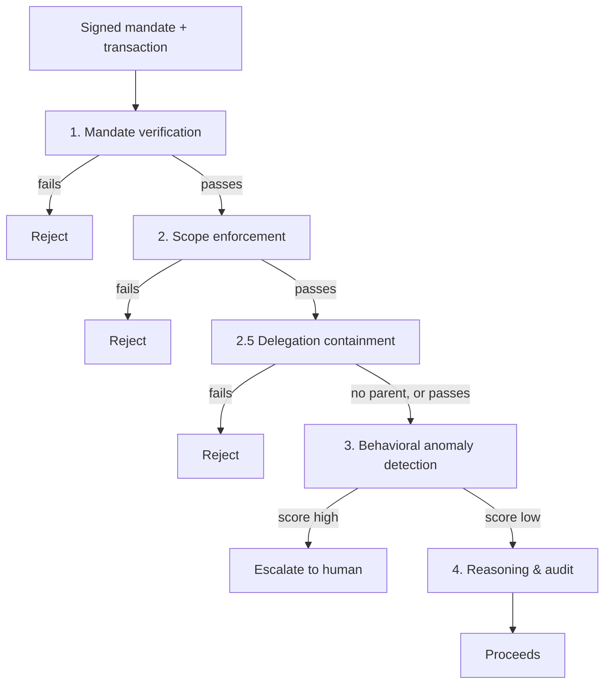

# Agentic-Commerce Transaction Sentinel


**[Live demo →](https://the-turing-line.vercel.app)** · [OVERVIEW.md](OVERVIEW.md) (five minutes, plain language) · [THREAT_MODEL.md](THREAT_MODEL.md) · [EXCEPTIONS.md](EXCEPTIONS.md) · Razorpay AI Buildathon 2026, Track 02 (AI Risk Manager)

Mandate verification, delegation-chain containment, and behavioral anomaly detection for AI agents transacting on a human's behalf, with a formally verified deterministic core and an evaluation methodology built to survive a skeptical read.

---

## Table of contents

1. [Overview](#overview)
2. [The problem](#the-problem)
3. [System architecture](#system-architecture)
4. [Design decisions](#design-decisions)
5. [Evaluation methodology and results](#evaluation-methodology-and-results)
6. [The held-out evaluation: a case study in disclosed failure](#the-held-out-evaluation-a-case-study-in-disclosed-failure)
7. [Reproducibility](#reproducibility)
8. [Interoperability: AP2 and NPCI's UAP](#interoperability-ap2-and-npcis-uap)
9. [API reference](#api-reference)
10. [Security, safety, and threat model](#security-safety-and-threat-model)
11. [Known limitations](#known-limitations)
12. [Getting started](#getting-started)
13. [Repository structure](#repository-structure)
14. [Roadmap and deliberate scope cuts](#roadmap-and-deliberate-scope-cuts)
15. [Technical references](#technical-references)
16. [License](#license)

---

## Overview

Agentic commerce changes what "is this transaction legitimate" means. Until recently, a human clicked "buy" on every purchase, so authorization and legitimacy were the same question, and the entire fraud-detection industry was built to answer it: is this card real, is this merchant real, is this device the one this customer normally uses. Once an agent can spend on a human's behalf without a confirmation on every transaction, a new question opens up underneath all of that, one existing fraud infrastructure was never built to ask: **is this agent still doing what it was actually authorized to do.**

This project answers that question. Every agent action here carries a **mandate**, a cryptographically signed, machine-checkable record of what a human actually authorized: how much, at which merchants, in which categories, for how long, and how that authority may be delegated further. A transaction is checked against its mandate through a layered pipeline, deterministic checks first, a learned anomaly detector second, each layer catching a different way an agent's behavior can drift outside its actual grant. The system is a verifier and detector only. It never initiates a payment, never carries offensive capability, and every automated finding routes to a human rather than acting unilaterally.

What differentiates this submission from a typical hackathon fraud detector is not any single layer; it is the discipline the whole thing was built under. Every headline number below reproduces from a documented command against a pinned dependency set. The system was tested against an attack class it was deliberately never trained or tuned against, and the first version caught almost none of it, a result that is reported here at the same prominence as the passing numbers, not filed away as a footnote. The deterministic core is not just tested against hand-picked cases; it is formally verified with an SMT solver against every input in a realistic bounded space, and that verification is demonstrated to actually catch a bug, not just asserted to work. Every architectural boundary the system currently has, including the two pieces of tested logic that are not wired into the live decision endpoint, is disclosed in this document before a reviewer has to find it.

---

## The problem

Tell an agent "spend up to ₹2,000 a month on groceries," and one month it spends ₹8,000 on electronics instead. Every classical fraud signal on that transaction is clean: the card is real, the merchant is real, the device is real, no credentials were stolen. The failure is not that anyone stole anything; it is that the agent did something it was never authorized to do. No existing fraud system asks that question, because until agentic commerce existed, there was no daylight between "a human clicked buy" and "a human authorized this."

Razorpay's own stack does not cover this gap either: Vulcan scores transactions, not the authorization behind them; Bumblebee reviews merchants, not agent sessions; Agent Studio's tools are post-hoc. This system sits in front of all three, checking authorization before a transaction is allowed to happen, not after it has already gone through.

The same failure mode compounds under delegation. An agent authorized for ₹2,000 a month can itself delegate a narrower mandate to a sub-agent, and that sub-agent can delegate again. A chain of individually plausible-looking delegations can bootstrap a much larger unauthorized action than any single mandate in the chain would suggest on its own, exactly the failure mode this project's own held-out evaluation (below) found the original design did not see at all.

---

## System architecture

### Design principles

- **Deterministic layers can only add a block, never remove one.** A learned layer can miss something new, but it can never unblock a session a deterministic rule already flagged. Proved, not just asserted: Z3 property P8 below.
- **No feature is a deterministic function of the ground-truth label.** Enforced structurally, not by convention: `LabeledSession` wraps `SessionTrace` so only the bare trace type-checks into feature extraction; the label is not reachable from inside the detector's own code path.
- **Every random draw traces to a named, committed seed.** The same `(n, seed)` pair reproduces byte-identical output, checked directly (see [Reproducibility](#reproducibility)), not assumed from good intentions.
- **Fail closed on anything unrecognized.** A `MandateScope` field the containment engine has no rule for raises an error rather than passing silently; an audit-log entry that does not match its own recorded hash reports as broken rather than being skipped.
- **Human-in-the-loop is enforced structurally, not documented as a convention.** Escalation review, resolution, and circuit-breaker resets all reject a system-actor caller outright (HTTP 422), not merely by house style.
- **Narration explains a verdict; it never sets one.** Enforced at the type level (frozen dataclasses, no verdict-typed field on narration output) and proved under adversarial pressure (six prompt-injection payload types, including a fake client that actively tries to comply).

### The decision pipeline



### Layers

| Layer | Checks | Stops | Package |
|---|---|---|---|
| 1. Mandate verification | Signature genuine, unexpired, right key, budget not exhausted, key not revoked | An unregistered key, a forged signature, an expired or budget-exhausted mandate, a session presented after its key was revoked | `/mandate` |
| 2. Scope enforcement | Amount, currency, merchant, category, time window against what the mandate actually grants | A transaction outside the mandate's own declared bounds, checked exactly, no tolerance band | `/detect` (`scope.py`) |
| 2.5. Delegation containment | A delegated mandate's authority against its resolved parent's | A delegated mandate that exceeds its parent's ceiling, category grant, time window, or transaction count; a sibling group that collectively over-commits a shared parent; a cyclic or over-deep delegation chain | `/containment` |
| 3. Behavioral anomaly detection | Session timing and usage patterns against what the claimed agent's own history looks like | Sessions that pass Layers 1 and 2 cleanly but do not move like the agent they claim to be (mandate replay, impersonation) | `/detect`, `/features` |
| 4. Reasoning & audit | Nothing (narrates and records instead) | Nothing by design; produces a plain-language explanation and an append-only, hash-chained audit record for every decision | `/reasoning` |

Layers 1, 2, and 2.5 are deterministic and evaluated in strict order; Layer 3 runs on whatever reaches it and can escalate but never override a deterministic rejection. Layer 4 always runs last and never feeds back into the verdict.

### The full system, beyond the four numbered layers

| Package | What it is | Live-wired? |
|---|---|---|
| `/formal` | Z3 SMT encoding of Layers 1, 2, and 2.5's real decision logic; 8 safety properties proved exhaustively over a bounded space | Offline verification tool, not part of request handling |
| `/collusion` | Graph construction plus Louvain community detection over agent sessions, surfacing coordinated multi-agent abuse a single-session view cannot see | Separate detection surface; not wired into `/sessions/decide` |
| `/counterfactual` | Solver-verified minimal-edit explanations ("what would have made this allowed") for deterministic blocks; a SHAP-prioritized bisection search for behavioral blocks | Layers 1/2's counterfactual is live-wired; Layer 2.5's and Layer 3's are library-only (see below) |
| `/escalation` | Human-gated review queue and a per-agent circuit breaker; suspension is sticky and lifts only via an explicit human action | Live-wired: a suspended agent short-circuits before Layers 1-3 run |
| `/interop` | Bidirectional adapter between this project's mandate schema and Google's AP2 | Library-level, used to translate mandates at the boundary, not part of the live decision path |
| `/policy` | A declarative YAML re-encoding of Layer 2's real rules, linted and proved behaviorally identical to the hard-coded implementation over the full corpus | Not the live authoritative source (see below) |
| `/manifest` | Reproducibility attestation: every headline evaluation run emits a signed manifest of its seeds, commit, dependency hash, and full metrics | Offline tooling, not part of request handling |
| `/agent` | A real, tool-calling Groq agent (three tools only) whose checkout attempts are governed live by the real pipeline | The agent calls the real `decide()` and the real containment check in-process; see [ADR 0016](docs/adr/0016-governed-live-agent.md) |

### What is not wired into the live decision endpoint, and why

`service.main.decide()`, the API's one automatic per-session decision path, runs Layers 1, 2, 3, and 4. Two pieces of real, fully tested logic are deliberately **not** part of that automatic path, and both are disclosed here rather than left for a reviewer to discover:

- **Layer 2.5 (delegation containment).** A real check against the same production `containment` engine, exercised identically in the evaluation that produces the 76.14% headline recovery figure below, but reached today through a separate, explicit read (`GET /mandates/{id}/chain`, or the `/delegation` view). A transaction whose own scope is fine can be allowed by `decide()` even while its delegation chain would fail containment if checked, which is exactly the gap the Operations demo's headline scenario is built to show plainly. The reasoning for shipping it this way rather than reactively wiring a new call into the one live decision path under deadline pressure, without time to re-verify it does not regress any of the Z3-proved guarantees below, is in [THREAT_MODEL.md](THREAT_MODEL.md#layer-25-delegation-chain-containment-containment).
- **Policy-as-code (`/policy`).** Proves a declarative, linted, versioned YAML document reproduces Layer 2's real rules exactly, over the full generated corpus. It is not the live authoritative source for `decide()`, for the identical reason: governing a real decision from a newly built compiler instead of the already-shipped, already-tested rule code is a separate, larger decision than this component's own scope. Full reasoning: [ADR 0013](docs/adr/0013-policy-as-code.md).

A third boundary is narrower and worth stating precisely: **Layer 3's counterfactual explanation was built, then deliberately removed from the live HTTP path.** A minimal-edit counterfactual against the behavioral model is, by construction, a minimal adversarial perturbation, a live "change this feature by this much to evade detection" recipe handed back to the same caller whose session was just blocked. It was pulled from `decide()` on review and now exists only as a directly tested library function for a future internal-only reviewer tool. See the addendum in [ADR 0008](docs/adr/0008-counterfactual-explanations.md).

---

## Design decisions

Every non-trivial design choice in this project is recorded as an architecture decision record, append-only once written, so its own reasoning stays intact even after a later decision revises what it concluded. Read the table below for the overview; follow a link for full depth, including real bugs found while building each one.

| ADR | Decision |
|---|---|
| [0001](docs/adr/0001-attack-variant-hardness.md) | Deliberately widened the scripted-attack pacing bounds so Layer 3's advantage is not just one reconstructed threshold rule |
| [0002](docs/adr/0002-comparing-a-scorer-against-a-rules-engine.md) | Why precision-at-fixed-recall is unsatisfiable against a baseline that is precision-saturated by construction, and the complementary McNemar-based test used instead |
| [0003](docs/adr/0003-held-out-class-evaluation.md) | The held-out mandate-chaining class: 0.00% recall on an attack type authored with no visibility into detector internals, evaluated exactly once |
| [0004](docs/adr/0004-delegation-chain-containment.md) | Layer 2.5's design and its 76.14% recovery of the held-out gap, plus a later, honestly measured false-positive interaction under shared parent-pool contention |
| [0005](docs/adr/0005-formal-verification-of-deterministic-layers.md) | Z3 encoding of Layers 1, 2, and 2.5's real decision logic; 8/8 properties proved; a deliberately reversed comparison caught with a concrete counterexample |
| [0006](docs/adr/0006-collusion-ring-detection.md) | Graph and Louvain-based cross-agent ring detection; 100% recall and precision on planted rings, with a measured, disclosed density-sensitivity boundary |
| [0007](docs/adr/0007-tamper-evident-audit-log.md) | A SHA-256 hash chain over the audit log; detects tampering after the fact, does not prevent it |
| [0008](docs/adr/0008-counterfactual-explanations.md) | Solver-verified minimal-edit explanations for deterministic blocks; the behavioral counterfactual was built, then removed from the live HTTP path as a disclosed evasion-recipe risk |
| [0009](docs/adr/0009-escalation-queue-and-circuit-breaker.md) | A human-gated escalation workflow and a sticky, human-reset-only per-agent circuit breaker |
| [0010](docs/adr/0010-ap2-interop-adapter.md) | A live-repository field-by-field check against AP2 that corrected this project's own earlier, overstated compatibility claim |
| [0011](docs/adr/0011-delegation-graph-and-narration-chat.md) | A live, per-mandate delegation-chain view, plus an affordance inviting a user to argue with the verdict, which never moves it |
| [0012](docs/adr/0012-property-based-verification-of-containment.md) | Hypothesis-driven generative testing of the stateful sibling ledger, the one piece of Layer 2.5 Z3's proof structurally cannot reach |
| [0013](docs/adr/0013-policy-as-code.md) | A declarative YAML policy proved behaviorally identical to Layer 2's real rules; not the live authoritative source |
| [0014](docs/adr/0014-agent-key-lifecycle.md) | Key revocation and rotation, checked at decision time rather than only at registration; three real bugs found and fixed while wiring it into the live path |
| [0015](docs/adr/0015-run-manifests.md) | Signed reproducibility manifests; a real rerun-and-diff confirming byte-exact reproduction of every reported metric except wall-clock latency |
| [0016](docs/adr/0016-governed-live-agent.md) | A real, tool-calling Groq agent, structurally isolated from everything except three narrow tools, governed live by the real pipeline |

---

## Evaluation methodology and results

### Setup

Every number below comes from `python run_full_eval.py --n-legitimate 20000 --seed 42` against the frozen A/B pipeline: 20,833 total sessions, a 4,168-session held-back test block, a 4% realized attack base rate, evaluated at the calibrated operating threshold of 0.0251. The synthetic generator is fully seeded; the same `(n, seed)` pair reproduces byte-identical output, verified directly (see [Reproducibility](#reproducibility)).

### Headline results

| | Precision | Recall | AUC-PR | AUC-ROC |
|---|---|---|---|---|
| Rules-only baseline | 1.0000 | 0.8297 | 0.8465 [0.8135, 0.8794] | 0.9148 [0.8966, 0.9331] |
| Full ensemble | 0.9785 | 0.9976 | **0.9982** [0.9965, 0.9994] | 0.9998 [0.9996, 0.9999] |
| Layer 3 alone (test residual) | N/A | N/A | 0.9193 [0.8564, 0.9732] | 0.9989 [0.9980, 0.9996] |

95% confidence intervals, 1,000 bootstrap resamples. Reproduce: `python run_full_eval.py --n-legitimate 20000 --seed 42`.

### Statistical significance

The rules-only baseline is precision-saturated at 1.0 by construction: the legitimate generator places every session inside its own mandate's scope, so no Layer 1 or 2 rule can ever fire on one. That makes a literal "beat the baseline on precision at fixed recall" test unsatisfiable by any detector whatsoever; it can only be tied. [ADR 0002](docs/adr/0002-comparing-a-scorer-against-a-rules-engine.md) works through why, and the project's actual gate uses the complementary reading instead: how much recall the ensemble adds at the baseline's own precision, tested for significance with the paired test appropriate to two hard classifiers scored on the same sessions.

| Test | Result |
|---|---|
| Recall gained at baseline's precision | +0.0268 (0.8297 → 0.8564) |
| McNemar (paired, at the operating threshold) | baseline-only-correct 9, ensemble-only-correct 69, **p = 1.381×10⁻¹²** |
| DeLong (correlated AUC-ROC comparison) | +0.0850 (SE 0.00926), p = 4.565×10⁻²⁰. Reported as a secondary, low-resolution check, since the baseline's AUC is balanced accuracy, not a ranking |

Both favor the ensemble. Per-variant, the two attack types no deterministic rule can see at all move from 0.00 recall to 1.00 under the ensemble: `rapid_reuse` (mandate replay) and `behavioral_only` (impersonation, caught at 0.9821 of that variant specifically).

### Calibration

Brier score 0.00499, expected calibration error 0.00532 on the test residual. The reliability diagram's near-zero bin holds 3,752 of the residual's rows; every bin between roughly 0.1 and 0.9 holds fewer than ten sessions each, so the aggregate statistics above are well-supported at the extremes and thinly supported in the middle of the range, named directly in [EXCEPTIONS.md](EXCEPTIONS.md#4-the-sparse-middle-of-the-score-distribution) rather than smoothed over.

### Cost-sensitivity analysis

The operating threshold is chosen against an explicit false-negative-to-false-positive cost ratio, not eyeballed.

| Cost ratio | Min-cost threshold | Precision | Recall | Blocked legit / 10k |
|---|---|---|---|---|
| 1.0 | 0.0220 | 0.9785 | 0.9976 | 21.6 |
| 5.0 | 0.0220 | 0.9785 | 0.9976 | 21.6 |
| 10.0 | 0.0060 | 0.9580 | 1.0000 | 43.2 |
| 20.0 | 0.0060 | 0.9580 | 1.0000 | 43.2 |
| 30.0 | 0.0060 | 0.9580 | 1.0000 | 43.2 |

Full threshold sweep at cost ratio 10.0 (4,168 sessions, 411 attacks):

| Threshold | Precision | Recall | Blocked legit / 10k | Missed attacks / 10k |
|---|---|---|---|---|
| 0.000 | 0.0986 | 1.0000 | 9,013.9 | 0.0 |
| 0.006 | 0.9580 | 1.0000 | 43.2 | 0.0 |
| 0.100 | 0.9784 | 0.9903 | 21.6 | 9.6 |
| 0.200 | 0.9805 | 0.9805 | 19.2 | 19.2 |
| 0.400 | 0.9825 | 0.9562 | 16.8 | 43.2 |
| 0.600 | 0.9847 | 0.9367 | 14.4 | 62.4 |
| 0.800 | 0.9895 | 0.9148 | 9.6 | 84.0 |
| 1.000 | 1.0000 | 0.8297 | 0.0 | 167.9 |

### Latency

End-to-end decision latency, 2,950 decisions, 50 warm-up sessions excluded from the sample:

| p50 | p95 | p99 | min | max | mean |
|---|---|---|---|---|---|
| 2.762 ms | 3.424 ms | 4.048 ms | 1.878 ms | 6.901 ms | 2.853 ms |

### Generator parameter sensitivity

A 13-point, one-factor-at-a-time grid over the generator's own tunable parameters, checking whether the headline result depends on a fragile choice of any single one.

| Grid point | AUC-PR | Δ | Ensemble recall | Rules-invisible recall | Beats baseline |
|---|---|---|---|---|---|
| established setting | 0.9982 | N/A | 0.9976 | 0.9859 | N/A |
| `amount_median_x0.5` | 0.9982 | +0.0000 | 0.9976 | 0.9859 | True |
| `amount_median_x2` | 0.9982 | +0.0000 | 0.9976 | 0.9859 | True |
| `amount_sigma_x0.7` | 0.9983 | +0.0000 | 0.9951 | 0.9718 | True |
| `amount_sigma_x1.4` | 0.9982 | -0.0000 | 0.9976 | 0.9859 | True |
| `rapid_reuse_w0.2` | 0.9984 | +0.0002 | 0.9724 | 0.8154 | True |
| `rapid_reuse_w0.6` | 0.9986 | +0.0003 | 0.9648 | 0.8391 | True |
| `behavioral_only_w0.25` | 0.9898 | -0.0085 | 0.9659 | 0.7143 | True |
| `behavioral_only_w0.65` | 0.9971 | -0.0012 | 0.9950 | 0.9785 | True |
| `scripted_pacing_max10` | 1.0000 | +0.0018 | 1.0000 | 1.0000 | True |
| **`scripted_pacing_max35`** | **0.9796** | **-0.0186** | **0.9148** | **0.5070** | **False** |
| `skip_browse_p0.1` | 0.9936 | -0.0046 | 0.9746 | 0.8305 | True |
| `skip_browse_p0.6` | 0.9981 | -0.0001 | 1.0000 | 1.0000 | True |

Twelve of thirteen grid points still significantly beat the rules-only baseline. The one that does not, `scripted_pacing_max35`, widens the scripted-client inter-event gap to 35 seconds, pushing it almost entirely inside legitimate traffic's own 2-45 second jitter range; the two rules-invisible variants collapse from 0.9859 to 0.5070 recall. This is a real, disclosed fragility, not hidden behind the other twelve passing points: full discussion in [EXCEPTIONS.md](EXCEPTIONS.md#3-scripted-client-pacing-if-it-turns-out-to-resemble-real-agent-timing).

### Top SHAP features

Mean absolute contribution, test residual rows:

| Feature | Mean absolute contribution |
|---|---|
| `agent_prior_session_count` | 0.7605 |
| `mandate_prior_use_count` | 0.3720 |
| `hours_since_mandate_last_use` | 0.2919 |
| `max_event_gap_seconds` | 0.2786 |
| `hours_since_agent_last_session` | 0.1920 |
| `duration_seconds` | 0.1806 |

The top two features, both measures of how new an agent or mandate is to the system, are the plausible (though explicitly unconfirmed) mechanism behind the ~21.6-per-10k legitimate false-positive rate above: see [EXCEPTIONS.md §5](EXCEPTIONS.md#5-the-mirror-case-legitimate-sessions-this-system-blocks-anyway).

---

## The held-out evaluation: a case study in disclosed failure

This is the project's sharpest test of its own honesty, and it is treated as the headline finding, not a changelog entry.

**Method.** A fifth attack class, mandate chaining, five sub-variants (budget escalation, breadth escalation, temporal outliving a parent, unauthorized subdelegation to a second agent, small-siblings structuring), was authored by an isolated process with no visibility into the detector's design, held out of every training and tuning step entirely, and evaluated against the frozen Layers 1-3 pipeline exactly once. Nothing in `detect/`, `features/`, or the generator's tuning changed in reaction to the result, before or after measuring it, a standing constraint enforced across every subsequent milestone.

**Result, before Layer 2.5 existed.**

| | Held-out (mandate chaining) | In-distribution (three known classes) |
|---|---|---|
| Ensemble recall | **0.00%** | 99.76% |
| Attacks evaluated | 3,529 | 411 |

Every one of the 3,529 held-out attacks scored below half the operating threshold. Not a near-miss population: a total, structural blindness, because every check in Layers 1-3 reasons about one mandate in isolation, or one session against the mandate it presents, and none of them reference a mandate's relationship to its parent's authority at all.

**Response.** Layer 2.5 (delegation-chain containment) was built afterward as a new, separately labelled layer, five deterministic rules comparing a delegated mandate to its resolved parent, and evaluated exactly once against the same frozen held-out corpus, per the identical once-only discipline.

| Variant | n | Rules-only | + Containment | Full stack |
|---|---|---|---|---|
| `budget_escalation` | 456 | 0.00% | 100.00% | 100.00% |
| `breadth_escalation` | 439 | 0.00% | 100.00% | 100.00% |
| `temporal_outlive` | 462 | 0.00% | 100.00% | 100.00% |
| `fanout_structuring` | 1,748 | 0.00% | 75.46% | 75.46% |
| `unauthorized_subdelegation` | 424 | 0.00% | 2.59% | 2.59% |
| **Overall** | **3,529** | **0.00%** | **76.14%** | **76.14%** |

**What is still open, named directly.** `unauthorized_subdelegation` is a genuinely, validly signed hand-off whose scope matches its parent exactly; none of containment's five rules, all about authority width, have any reason to fire, and the 2.59% that is caught is incidental (a coincidental shared parent with an unrelated committed sibling), not a real detection of the subdelegation itself. `fanout_structuring`'s residual 24.54% is the first sibling in each group: individually within its own ceiling and, at the moment it is decided, indistinguishable from an ordinary delegation until later siblings arrive. Closing the first needs an agent-identity-continuity check, a different kind of property than anything Layer 2.5 was scoped to verify; closing the second needs a behavioral feature comparing a mandate's own fan-out rate against its agent's history, which Layer 3 does not currently have. Both are named as legitimate future work in [ADR 0004](docs/adr/0004-delegation-chain-containment.md), not attempted reactively.

**Reproduce, in order:**

```bash
python run_held_out_eval.py --n-legitimate 20000 --seed 42 --held-out-n-legitimate 20000 --held-out-seed 90042
python run_containment_eval.py --n-legitimate 20000 --seed 42 --held-out-n-legitimate 20000 --held-out-seed 90042
```

---

## Reproducibility

Every evaluation run can emit a signed manifest: the corpus parameter digest, the run-level config hash, every named seed (the base seed plus three per-attack-class offsets, Layer 3's own random state, and the bootstrap's seed), the git commit, whether the working tree was clean, a hash of the pinned dependency lock file, and the run's complete metrics dictionary, embedded rather than referenced. `run_verify_manifest.py` recomputes the structural fields against the current working tree and reports exactly which, if any, no longer match.

**Reproducibility was checked, not assumed.** The same command was run twice in the same working tree and the two manifests diffed field by field. Every field matched exactly, including every threshold, every precision/recall figure, every bootstrap confidence interval bound for every AUC breakdown, the full calibration curve, the Brier score, and every SHAP attribution value, except wall-clock latency, which by definition measures that run's own hardware and scheduling conditions and is explicitly disclosed as outside this reproducibility claim rather than forced into a false determinism. Full account: [ADR 0015](docs/adr/0015-run-manifests.md).

The headline run's manifest is committed at [`docs/manifests/headline_full_evaluation.manifest.json`](docs/manifests/headline_full_evaluation.manifest.json), content hash `c544e6a40ecf1e1aef91ce297ecdec47090951d10f0d55dfb2259fefee0943a6`.

---

## Interoperability: AP2 and NPCI's UAP

AP2 (Google's Agent Payments Protocol) and NPCI's UAP both handle how an agent *carries* authorization: a signed intent, a cart, a credential. Neither checks whether one specific transaction, or one specific delegation to another agent, actually *stayed inside* that authorization, which is this project's entire job, sitting in front of both, not replacing either.

AP2 was targeted for a concrete interop adapter because it is real, public, and has a live, citable reference implementation; UAP has no published schema yet, though this project's design already follows its reported direction where that is known. Before building anything, this project's own earlier compatibility claim was checked directly against AP2's live repository rather than trusted from memory, and the check found it overstated: AP2's `IntentMandate` has no spending-limit field, no category field, and no delegation-chain concept at all; the real price commitment lives three levels deep in a separate, merchant-signed `CartMandate`; AP2 is single-transaction by construction. Six of the ten fields this project's adapter needs have no AP2 source and are always caller-supplied, never guessed. The finding corrected both this project's README and its mandate schema's own module docstring in the same session it was found: **AP2-inspired, not an implementation of AP2.** Full field-by-field mapping: [ADR 0010](docs/adr/0010-ap2-interop-adapter.md).

---

## API reference

`service/main.py`, a FastAPI application. Interactive OpenAPI docs are served at `/docs` when running locally.

| Method | Path | Purpose |
|---|---|---|
| `GET` | `/health` | Liveness check |
| `GET` | `/agents/demo` | Lists the seeded demo agents, including their (deterministically derivable, non-secret) private keys |
| `POST` | `/agents/register` | Registers a new agent's Ed25519 public signing key |
| `POST` | `/agents/{agent_id}/keys/{key_id}/revoke` | Revokes a key immediately; a kill switch, always a human action |
| `POST` | `/agents/{agent_id}/keys/{old_key_id}/rotate` | Rotates a key with a documented overlap window |
| `GET` | `/agents/{agent_id}/keys/{key_id}/revocation` | Looks up a key's revocation record, if any |
| `POST` | `/sessions/decide` | Runs one session through Layers 1-4 and returns the full decision, or short-circuits if the agent is circuit-broken |
| `GET` | `/audit/{session_id}` | Returns every append-only audit record for a session |
| `GET` | `/escalations` | Lists escalations, optionally filtered by status or agent |
| `GET` | `/escalations/{escalation_id}` | Looks up one escalation |
| `POST` | `/escalations/{escalation_id}/review` | Marks an open escalation reviewed; rejects the system actor |
| `POST` | `/escalations/{escalation_id}/resolve` | Resolves a reviewed escalation; rejects the system actor and skipped review |
| `GET` | `/agents/{agent_id}/circuit-breaker` | Reports whether an agent is currently suspended |
| `POST` | `/agents/{agent_id}/circuit-breaker/reset` | Lifts a suspension; the only way one is ever lifted; rejects the system actor |
| `GET` | `/mandates/{mandate_id}/chain` | Returns a mandate's full delegation chain, each link's own Layer 2.5 verdict included |

No endpoint mutates a mandate or a payment outside `/sessions/decide` itself. Every mutating endpoint requires an attributed, non-system actor.

---

## Security, safety, and threat model

A detector and verifier, not an offensive or autonomous system anywhere in the stack. The attack generators that produce this project's own test traffic are read/query-only against this project's own detectors, with no mutating endpoints and no real payment or personal data anywhere. Full page: [THREAT_MODEL.md](THREAT_MODEL.md).

| Layer | Stops | Explicitly does not stop |
|---|---|---|
| 1. Mandate verification | Forged signatures, expired or budget-exhausted mandates, a revoked key | A genuinely signed mandate for something it never should have authorized (Layer 2's job); a compromised key used before anyone revokes it |
| 2. Scope enforcement | Any transaction outside a mandate's declared bounds | A sub-mandate within its own stated scope but never actually authorized upstream (Layer 2.5's job) |
| 2.5. Delegation containment | Authority-width violations across a delegation chain | `unauthorized_subdelegation` (identity, not width); real-world distribution shift is untested by construction |
| 3. Behavioral anomaly detection | The two attack types invisible to Layers 1-2 by construction | Anything alone; only ever adds a block, never overrides a deterministic rejection; trained on synthetic timing, the clearest open question for real-world transfer |
| 4. Reasoning & audit | Nothing by design | A narration failure never fails the decision; narration text is not reproducible the way every measured number is |
| Formal verification | Proves 8 properties of Layers 1/2/2.5's decision logic exhaustively | Anything about Layer 3, which is abstracted as a free input; the stateful sibling ledger beyond a fixed 4-sibling unrolling (Hypothesis testing covers that instead) |
| Collusion detection | Three coordination archetypes at 100% recall/precision | Collusion at higher per-agent density than calibrated for, a measured and disclosed boundary; is a separate surface, not wired into live decisions |

**What no layer here stops:** a key compromised and used before a human revokes it (revocation is real but never automatic); real-world distribution shift, since every number in this project comes from a synthetic, seeded generator; and a compromised deployment process itself, since this is a detection and verification layer sitting in front of a payment flow, not a general application-security posture for whatever infrastructure runs it.

**On the reasoning layer specifically:** narration is structurally non-mutating. `reasoning/narrate.py` has no verdict-typed field on its output, an AST-level test proves it never imports the detection modules, and it was tested against six adversarial prompt-injection payload types, including fake `SYSTEM:` lines, prompt-leak requests, persona jailbreaks, and a worst-case fake LLM client that actively tries to comply with an embedded override. In every case, the reported verdict and rule citations did not move, because they are derived structurally from the decision itself, never parsed from the model's own text. Narration and the live agent's transcripts always state which model actually produced them (`groq:openai/gpt-oss-120b` when a real call was made, a documented scripted fallback when Groq is unreachable), never shown as live when they are not.

---

## Known limitations

Every population-level exception this evaluation surfaces, named specifically and reproducibly. Full detail, including the closest signal that fired for each and what would resolve it: [EXCEPTIONS.md](EXCEPTIONS.md).

1. **Mandate-chaining residual** (`unauthorized_subdelegation`, the first sibling of `fanout_structuring`): see [above](#the-held-out-evaluation-a-case-study-in-disclosed-failure).
2. **One in-distribution miss.** Even restricted to the three trained-against classes, recall is 99.76%, not literally 100%; one `behavioral_only` session scored 27% of the operating threshold, the ordinary tail of any thresholded classifier.
3. **Scripted-pacing fragility.** If real agentic traffic resembles the widened `scripted_pacing_max35` grid point, Layer 3's advantage on the two rules-invisible variants roughly halves. Measuring real agent inter-event timing before production reliance on this signal is the concrete next step.
4. **A sparse calibration middle.** The reliability diagram is dominated by one near-zero bin; every bin between 0.1 and 0.9 holds fewer than ten sessions, so the aggregate Brier score and ECE are well-supported at the extremes and thinly supported in between.
5. **A measured, not fully explained, false-positive rate.** 21.6 legitimate sessions per 10,000 are blocked at the deployed threshold. The plausible mechanism (new agents and mandates scoring closer to the attack population) is stated as inference from the SHAP ranking, not as a confirmed, dedicated measurement.
6. **Docker is written but not build-verified end to end.** `service/Dockerfile`'s package list is verified correct against the real import graph of `service.main` (confirmed by importing the module with only the copied packages present), but no Docker binary was available in this development environment to run an actual `docker build`/`docker run`.

---

## Getting started

### Prerequisites

- Python 3.11 or 3.12 (CI-equivalent verification in this repository was run against 3.12.4)
- Node.js and npm, for the frontend
- Optional: a Groq API key, for live Layer 4 narration and the live agent (`.env.example` documents the variable; everything else, including the full detection pipeline, works identically without one)

### Installation and verification

```bash
python3.12 -m venv .venv && source .venv/bin/activate   # Windows: .venv\Scripts\Activate.ps1
pip install -r requirements-lock.txt && pip install -e ".[dev]"

pytest -q                                                        # 772 passed
ruff check .                                                      # clean
mypy --strict .                                                   # clean, 198 source files
```

`requirements-lock.txt` pins the full dependency closure to exact resolved versions, so this reproduces the exact environment every number in this document was verified against, not a range that could silently drift.

### Running the evaluation suite

```bash
python run_full_eval.py --n-legitimate 20000 --seed 42 --manifest-out my_manifest.json
python run_held_out_eval.py --n-legitimate 20000 --seed 42 --held-out-n-legitimate 20000 --held-out-seed 90042
python run_containment_eval.py --n-legitimate 20000 --seed 42 --held-out-n-legitimate 20000 --held-out-seed 90042
python run_verify_policy_properties.py                           # Z3, expect 8/8 proved
python run_verify_manifest.py --manifest-path docs/manifests/headline_full_evaluation.manifest.json
```

One `run_*.py` entry point per evaluation, export, or verification task, all at the repository root.

### Running the service and the dashboard

```bash
uvicorn service.main:app --reload                                # the API service, docs at /docs
cd frontend && npm install && npm run dev                        # the dashboard
```

The frontend is a static Vite build with zero backend dependency when `VITE_API_BASE_URL` is unset (the case for the hosted build below); it falls back to real, pre-computed fixture data. Or skip all of the above and use the hosted live site directly: [the-turing-line.vercel.app](https://the-turing-line.vercel.app).

### Docker

```bash
docker build -f service/Dockerfile -t sentinel-service .
docker run -p 8000:8000 --env-file .env sentinel-service
```

The Dockerfile's package list is verified against `service.main`'s real import graph (see [Known limitations](#known-limitations)); the build and run commands themselves have not been exercised end to end in this development environment.

---

## Repository structure

| Path | Contents |
|---|---|
| `/mandate` | Ed25519 mandate schema, signing, verification, key lifecycle |
| `/detect` | Scope rules (Layer 2), behavioral model, ensemble, calibration, attribution |
| `/containment` | Layer 2.5: delegation-chain containment rules and the sequential sibling ledger |
| `/features` | Session feature extraction for the behavioral layer |
| `/reasoning` | Groq-backed narration and the hash-chained audit log |
| `/formal` | Z3 encoding and proof of Layers 1/2/2.5's decision logic |
| `/collusion` | Cross-agent, cross-session ring detection |
| `/counterfactual` | Minimal-edit "what would have changed this verdict" explanations |
| `/escalation` | Human-in-the-loop review queue and the per-agent circuit breaker |
| `/interop` | The AP2 mandate adapter |
| `/policy` | Declarative YAML policy, proved behaviorally identical to Layer 2 |
| `/manifest` | Run manifests and reproducibility attestation |
| `/agent` | The real, tool-calling Groq shopper agent Sentinel governs live |
| `/service` | The FastAPI service wrapping every layer, plus the Dockerfile |
| `/generator` | Synthetic legitimate traffic and every attack class, including the held-out one |
| `/eval` | Metrics, significance tests, cost/latency/sensitivity analysis, one-shot evaluations |
| `/common` | Shared session schema and the generic hash-chain primitive |
| `/frontend` | The dashboard, hosted at the live demo link above |
| `/docs/adr` | Architecture decision records, one per major design choice, append-only once written |
| `/docs/manifests` | Committed reproducibility manifests for headline evaluation runs |
| `/tests` | The backend test suite, 772 tests |

---

## Roadmap and deliberate scope cuts

Cut deliberately, not overlooked, so their absence reads as a scoping decision rather than an oversight: an MCP connector, an adversarial robustness study beyond the sensitivity grid above, drift detection, a second held-out attack class, and hosting the live API service continuously (the frontend is hosted; the backend runs locally or via the Dockerfile). Each was scoped out to keep what actually shipped at the same bar as everything else in this document, rather than adding breadth at the cost of depth anywhere already built.

The two named, unclosed gaps in the held-out evaluation (agent-identity continuity across a delegation chain, and a behavioral fan-out-rate feature) are the most concrete, well-specified next steps, both described in [ADR 0004](docs/adr/0004-delegation-chain-containment.md). Wiring Layer 2.5 and policy-as-code into the live `decide()` endpoint, once each has been re-verified not to regress any of the properties proved in [ADR 0005](docs/adr/0005-formal-verification-of-deterministic-layers.md), is the natural next integration step, described but deliberately not rushed in [ADR 0013](docs/adr/0013-policy-as-code.md).

---

## Technical references

Techniques this project builds on, cited rather than assumed:

- Lundberg, S. M. & Lee, S.-I. (2017). *A Unified Approach to Interpreting Model Predictions.* SHAP attribution, `/detect/attribution.py`.
- McNemar, Q. (1947). *Note on the sampling error of the difference between correlated proportions or percentages.* The paired significance test used throughout the evaluation harness.
- DeLong, E. R., DeLong, D. M., & Clarke-Pearson, D. L. (1988). *Comparing the areas under two or more correlated receiver operating characteristic curves: a nonparametric approach.* The secondary AUC-ROC comparison, hand-rolled and verified against scikit-learn's output.
- Bernstein, D. J. et al. *Ed25519: high-speed high-security signatures.* This project's mandate signing scheme.
- De Moura, L. & Bjørner, N. (2008). *Z3: An Efficient SMT Solver.* The formal verification backend, `/formal`.
- Blondel, V. D. et al. (2008). *Fast unfolding of communities in large networks.* The Louvain community-detection algorithm, `/collusion`, via `networkx`.

---

## License

MIT, see [`LICENSE`](LICENSE).
